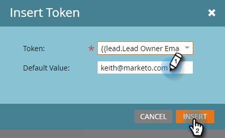

# リードの所有者からの電子メールの送信{#send-emails-from-the-lead-owner}

リードの所有者の代わりにリードに電子メールを送信したい場合はどうしますか。  これが方法です。

1. 電子メールを探し、選択して「**ドラフトを編集**」をクリックします。

   

1. 「**開始**」フィールドをクリックし（既存の名前を削除）、「**トークンを挿入**」ボタンをクリックします。

   

1. 「`{{lead.Lead Owner`」と入力中に開始が発生し、**`{{lead.Lead Owner First Name}}`**&#x200B;トークンを選択します。

   

1. リードにまだリードの所有者がない場合にデフォルト値を入力し、「**挿入**」をクリックします。

   

1. 最初のトークンの後のをクリックし、スペースを追加してから、**「トークンを挿入**」ボタンをクリックします。

   

1. 「`{{lead.Lead Owner`」と入力中に開始が発生し、**`{{lead.Lead Owner Last Name}}`**&#x200B;トークンを選択します。

   

1. リードにまだリードの所有者がない場合にデフォルト値を入力し、「**挿入**」をクリックします。

   

   >[!TIP]
   >
   >名前の最初のトークンと最後のトークンの間にスペースを追加したことを確認します。

1. 「電子メールから」フィールドをクリックし（既存の電子メールアドレスを削除）、「トークンの挿入」ボタンをクリックします。

   

1. 「`{{lead.Lead Owner`」と入力中に開始が発生し、**`{{lead.Lead Owner Email Address}}`**&#x200B;トークンを選択します。

   

1. リードにまだリードの所有者がない場合にデフォルト値を入力し、「**挿入**」をクリックします。

   

1. **返信先**&#x200B;と&#x200B;**件名**&#x200B;のフィールドに値が入力されていることを確認し、完了しました。

   
