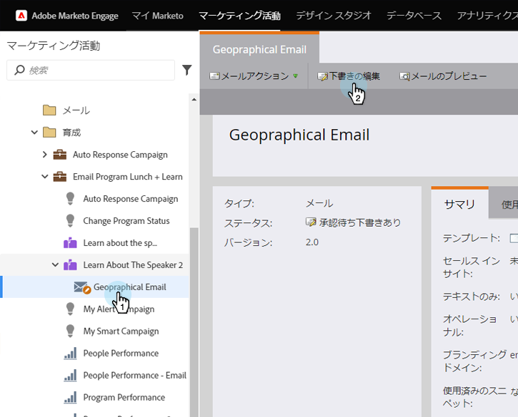

# 電子メールでの動的コンテンツの使用 {#using-dynamic-content-in-an-email}

>[!PREREQUISITES]
>
>* [セグメントの作成](../../../../product-docs/personalization/segmentation-and-snippets/segmentation/create-a-segmentation.md)

>

電子メールの動的コンテンツを使用して、リードのターゲット設定情報を送信します。

## 追加分類 {#add-segmentation}

1. 「マーケティングアクティビティ」に移動します。

   

1. 電子メールを選択し、「ドラフトを編集」をクリックします。

   

1. この例では、件名行を動的にします。 「件名」フィールドをクリックし、「動的に **する** 」ボタンをクリックします。

   

   >[!NOTE]
   >
   >電子メール内の要素を動的にすることもできます。 これを行うには、領域を選択し、歯車アイコンをクリックして、「動的に **する** 」(または実行する操作に応じて「スニペットに [置換](../../../../product-docs/personalization/segmentation-and-snippets/snippets/create-a-snippet.md)」)を選択します。

   セグメント名を入力し、選択して「保存」をクリックします。

   

   セグメントとそのセグメントが右側の「動的」タブに表示されます。

   

## 動的コンテンツの適用 {#apply-dynamic-content}

>[!CAUTION]
>
>使用できる動的コンテンツ要素の数に制限はありません。 具体的な数の制限はありません（コンテンツの組み合わせによって異なる場合があります）が、動的なコンテンツを過度に使用すると、電子メールのパフォーマンスに悪影響を与える可能性があります。 電子メールあたり20未満に抑えるために使用する動的コンテンツ要素の量を維持することをお勧めします。

1. セグメントをクリックし、件名を追加します。

1. 各セグメントに対して同じ手順を繰り返します。

   

>[!TIP]
>
>コンテンツを様々なセグメントに適用する前に、デフォルトの電子メールを作成します。

>[!CAUTION]
>
>デフォルトのセグメントコンテンツブロックに対する変更は、すべてのセグメントに適用されます。

甘い！ これで、ターゲットオーディエンスに柔軟な電子メールを送信できます。

>[!NOTE]
>
>**関連記事**
>
>* [動的コンテンツを使用した電子メールのプレビュー](preview-an-email-with-dynamic-content.md)
>* [ランディングページでの動的コンテンツの使用](../../../../product-docs/demand-generation/landing-pages/free-form-landing-pages/use-dynamic-content-in-a-free-form-landing-page.md)

>

