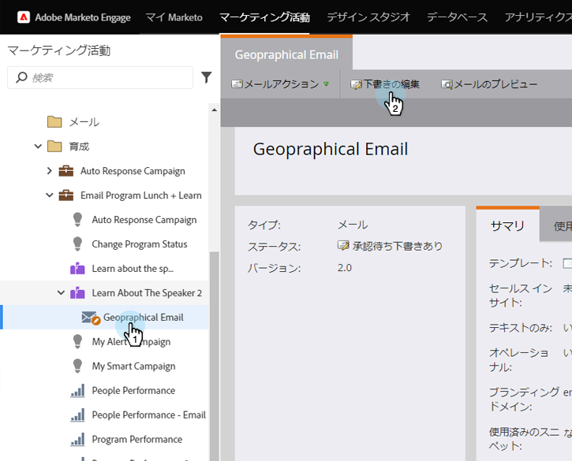
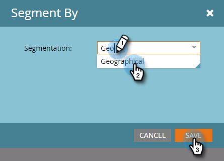
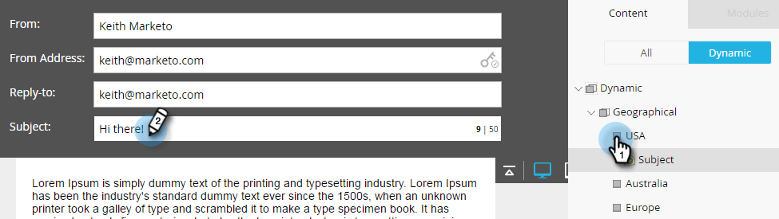

# メールでの動的コンテンツの使用 {#using-dynamic-content-in-an-email}

>[!PREREQUISITES]
>
>[セグメント化の作成](/help/marketo/product-docs/personalization/segmentation-and-snippets/segmentation/create-a-segmentation.md)

メール内の動的コンテンツを使用して、リードのターゲット情報を送信します。

>[!NOTE]
>
>メール内での動的コンテンツ内での変数の使用は、トリガーキャンペーンの使用時にのみサポートされます。 これは、バッチキャンペーンを使用する場合にはサポート&#x200B;**されません**。

## セグメント化を追加 {#add-segmentation}

1. **[!UICONTROL マーケティングアクティビティ]**&#x200B;に移動します。

   

1. メールを選択して、「**[!UICONTROL ドラフトを編集]**」をクリックします。

   

1. この例では、件名を動的にします。 「[!UICONTROL 件名]」フィールドをクリックし、「**動的にする**」ボタンをクリックします。

   

   >[!NOTE]
   >
   >また、メール内の要素を動的にすることもできます。 これを行うには、領域を選択し、歯車アイコンをクリックして、**動的にする** （または[実行している内容に応じてスニペット ](/help/marketo/product-docs/personalization/segmentation-and-snippets/snippets/create-a-snippet.md)に置き換える）を選択します。

1. セグメント名を入力して選択し、「**[!UICONTROL 保存]**」をクリックします。

   

   セグメント化とそのセグメントが右側の「[!UICONTROL 動的]」タブに表示されます。

   

## 動的コンテンツの適用 {#apply-dynamic-content}

>[!CAUTION]
>
>使用できる動的コンテンツ要素の数に制限はありません。 具体的な数の制限はありませんが（コンテンツの組み合わせによって異なる場合があります）、動的コンテンツを過剰に使用すると、メールのパフォーマンスに悪影響を与える可能性があります。 従来の動的コンテンツ要素の量は、メールあたり 20 未満にすることをお勧めします。

1. セグメントをクリックし、件名を追加します。

1. 各セグメントに対して繰り返します。

   

>[!TIP]
>
>様々なセグメントにコンテンツを適用する前に、デフォルトのメールを作成します。

>[!CAUTION]
>
>デフォルトのセグメントコンテンツブロックに対する変更は、すべてのセグメントに適用されます。

できましたね。 これで、ターゲットオーディエンスに適応したメールを送信できます。

>[!MORELIKETHIS]
>
>* [動的コンテンツを含むメールのプレビュー](/help/marketo/product-docs/email-marketing/general/functions-in-the-editor/preview-an-email-with-dynamic-content.md)
>* [ランディングページでの動的コンテンツの使用](/help/marketo/product-docs/demand-generation/landing-pages/free-form-landing-pages/use-dynamic-content-in-a-free-form-landing-page.md)
