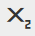

# リッチテキストエディタの使用{#using-the-rich-text-editor}

リッチテキストエディター(RTE)は、マーケティング全体に表示され、コンテンツを追加または編集する場合にいつでも使用できます。 ランディングページ、プログラム、電子メール、フォーム、スニペットで、 「**ドラフトを編集**」をクリックするとポップアップ表示され、表示されます。

## エディタ設定{#editor-settings}

ルートブロック要素の設定は、コンテンツをラップするタグを定義します。 デフォルトでは、電子メールのルートブロック要素は、 
 タグ、 次の手順に従って変更することができます。

>[!TIP]
>
>ルートブロック要素を選択するオプションはありますが、最適なユーザエクスペリエンスを得るために、常にデフォルト設定を使用することをお勧めします。

1. 「**管理者**」をクリックします。

   

1. 「**電子メール**」をクリックします。

   

1. 「**テキストエディター設定を編集**」をクリックします。

   

1. **電子メール/スニペットエディター**&#x200B;ドロップダウンで、「 
 または「なし」をクリックし、「**保存**」をクリックします。 
 は、この例で使用されています。

   

   もし 

 電子メールテンプレートで、セクションを開き、エディターで「Text Goes Here」と入力すると、次のHTMLソースの動作が表示されます。

<table> 
 <tbody> 
  <tr> 
   <th>&lt;p&gt;</th> 
   <th>&lt;div&gt;</th> 
   <th>なし</th> 
  </tr> 
  <tr> 
   <td>
&lt;div class="“mktEditable”"&gt; &lt;p&gt;Text Goes Here&lt;/p&gt; &lt;/div&gt;
</td> 
   <td>
&lt;div class="“mktEditable”"&gt; &lt;div&gt;Text Goes Here&lt;/div&gt; &lt;/div&gt;
</td> 
   <td>
&lt;div class="“mktEditable”"&gt; Text Goes Here &lt;/div&gt;
</td> 
  </tr> 
 </tbody> 
</table>

>[!TIP]
>
>同じ手順に従ってランディングページエディタのルートブロック要素を変更することもできますが、電子メール/スニペットエディタの代わりに手順4で&#x200B;**ランディングページエディタ**&#x200B;ドロップダウンをクリックします。

>[!NOTE]
>
>ルートブロック要素は常に 
 リッチテキストプログラムトークンの場合。

## 機能{#features}

RTEには次の機能が含まれます。

| アイコン | 名前 | 機能 |
|---|---|---|
|  | フォントファミリ | お前のやり方を選べ — 我々は豊かだ！ |
|  | フォントサイズ | どのくらいの大きさが欲しい？ 8px ～ 90pxの25個の選択肢 |
|  | スタイル | 「段落」または6つの見出しスタイル(ランディングページの場合)を選択します。 |
|  | 行間 | 線の間の距離を選択します。 |
|  | テキストカラー | 黒、赤、何でも好き。 |
|  | 背景色 | 強調用に強調表示 |
|  | 太字 | **濃く太い**。 |
|  | 斜体 | *角度付き。強調や*&#x200B;引用に使用します。 |
|  | 下線 | テキストの下に線を引きます。 |
|  | 整列 | このドロップダウンを使用して、テキストと画像をレイアウトします。 中央揃え、左右揃えを選択するか、両端揃えで端から端まで拡大します。 |  |  | リスト | ドロップダウンから箇条書き記号または数字を選択します。 箇条書きは、リストや段落付きの数字に適しています。 |
|  | インデント | インデントを増減します。 段落や目立たせるテキストに使用します。 |
|  | リンクの挿入/編集 | Webサイトまたは他のコンテンツへのリンクを挿入する。簡単に変更できます。 |
|  | イメージの挿入/編集 | 絵は千語の価値がある。 1つ入れて。 カメラアイコンをクリックして、Design Studioを参照します。 画像を並べてドロップできます。 |
|  | トークンの挿入 | 電子メールのパーソナライゼーションとデータ追跡に最適な強力なツールです。 必ずデフォルト値を入力してください。 |
|  | 元に戻す | おっと！ 一歩戻って、もう一度やり直しましょう。 |
|  | やり直し | 本当に問題ない場合は、元の状態に戻します。 |
|  | 表 | このように自分で作れ。 ドロップダウンメニューを使用して設定できます。 |
|  | アンカーの挿入 | 投錨！ |
|  | 水平線 | 多くの用途 — セクションの分割に最適です。 |
|  | HTMLを編集 | HTMLソースエディターをポップアップ表示して、コードを調整できます。 |
|  | 下付き文字 | ぶら下がり文字（O`2`のように） |
|  | 上付き | お前は力を持っている！ (2`6`)。 |
|  | 取り消し線 | `<s>Put a line through text, like this</s>`. |
|  | 特殊文字 | ユーロの話をしたい？ 数学？ 選択肢は243。 |
|  | 検索と置換 | 個々のインスタンスを自分で探すよりも、ものを検索して変更する方がはるかに高速です。 |
|  | 書式をクリア | 標準に戻す |
|  | キャンセル | ボタンを押して「気にしないで」と言います |
|  | 保存 | ボタンを押して「OK好き」と言います |

>[!TIP]
>
>HTMLとテキストは別の画面で編集します。 「**テキスト**」タブの「**HTMLからコピー**」をクリックし、「**保存**」をクリックして、テキストがHTMLと一致するようにしてください。

>[!NOTE]
>
>フォントは、ドロップダウンに含まれるものに制限されません。 HTMLコードにアクセスして、一覧に表示されていないコードを使用できます。 Marketoでは、すべてのWebフォントがサポートされていますが、Webフォントはすべての電子メールクライアントで普遍的に機能するわけではありません。

## ランディングページ{#landing-pages}

ルートブロック要素の設定は、コンテンツをラップするタグを定義します。 デフォルトでは、ランディングページのルートブロック要素は 
 タグ、 次の手順に従って、この設定を変更することができます。

>[!TIP]
>
>ルートブロック要素を選択するオプションはありますが、最適なユーザエクスペリエンスを得るために、常にデフォルト設定を使用することをお勧めします。

1. 「**管理者**」をクリックします。

   

1. 「**電子メール**」をクリックします。

   

1. 「**テキストエディター設定を編集**」をクリックします。

   

1. **ランディングページエディター**&#x200B;ドロップダウンで、「 
 または「なし」をクリックし、「**保存**」をクリックします。 
 は、この例で使用されています。

   

   それだ！

