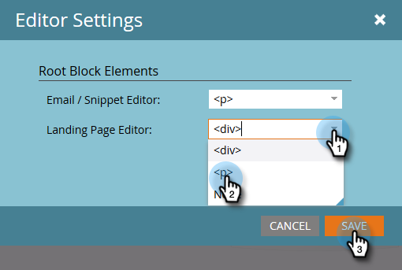

# リッチテキストエディターの使用 {#using-the-rich-text-editor}

リッチテキストエディター（RTE）は、Marketo 全体で表示され、コンテンツを追加または編集する際に使用できます。ランディングページ、プログラム、メール、フォーム、スニペットにバージョンが表示されます。「**ドラフトを編集**」をクリックするだけで使用できます。

## エディター設定 {#editor-settings}

ルートブロック要素の設定は、コンテンツをラップするタグを定義します。デフォルトでは、メールルートブロック要素は `
` タグを利用します。次の手順に従って変更することもできます。

>[!TIP]
>
>ルートブロック要素を選択するオプションはありますが、最適なユーザーエクスペリエンスを得るために、常にデフォルト設定を使用することをお勧めします。

1. 「**管理**」をクリックします。

   

1. 「**メール**」をクリックします。

   

1. 「**テキストエディター設定を編集**」をクリックします。

   

1. **メール／スニペットエディター**&#x200B;ドロップダウンで、「`
`」または「なし」を選択して、「**保存**」をクリックします。この例では `
` が使用されています。

   

   メールテンプレートに `

` がある場合、セクションを開き、エディターで「ここにテキストを入力」と入力すると、次の HTML ソース動作が表示されます。

<table> 
 <tbody> 
  <tr> 
   <th>&lt;p&gt;</th> 
   <th>&lt;div&gt;</th> 
   <th>None</th> 
  </tr> 
  <tr> 
   <td>
&lt;div class=“mktEditable”&gt; &lt;p&gt;ここにテキストを入力&lt;/p&gt; &lt;/div&gt;
</td> 
   <td>
&lt;div class=“mktEditable”&gt; &lt;div&gt;ここにテキストを入力&lt;/div&gt; &lt;/div&gt;
</td> 
   <td>
&lt;div class="“mktEditable”"&gt; ここにテキストを入力 &lt;/div&gt;
</td> 
  </tr> 
 </tbody> 
</table>

>[!TIP]
>
>ランディングページエディターのルートブロック要素を変更することもできます。これには、同じ手順に従い、手順 4 で&#x200B;**ランディングページエディター**&#x200B;ドロップダウン（メール／スニペットエディターの代わりに）をクリックします。

>[!NOTE]
>
>リッチテキストプログラムトークンの場合、ルートブロック要素は常に `
` です。

## 機能 {#features}

RTE に含まれる機能を次に示します。

| アイコン | 名前 | 機能 |
|---|---|---|
|  | フォント ファミリー | 自分のスタイルを選んでください。たくさんあります。 |
|  | フォント サイズ | どれくらいの大きさがいりますか？8px ～ 90px の 25 の選択肢。 |
|  | スタイル | 「段落」または「6 つの見出しスタイル」（ランディングページ用）を選択します。 |
|  | 行間 | 線間の距離を選択します。 |
|  | テキストカラー | 黒、赤、または何でも好きなもの。 |
|  | 背景色 | ハイライト表示して強調。 |
|  | 太字 | **より濃く、より太い**。 |
|  | 斜体 | *斜め（強調または引用）* |
|  | 下線 | テキストの下に行を配置します。 |
|  | 配置 | このドロップダウンを使用して、テキストと画像をレイアウトします。中央揃え、左または右揃えを選択するか、エッジをエッジに広げて位置合わせを完全におこないます。 |  |  | リスト | ドロップダウンから箇条書き記号または数字を選択します。箇条書き記号は、リストとステップ付きの番号に適しています。 |
|  | レベルを下げる | インデントを増減します。段落や目立たせる任意のテキストに使用します。 |
|  | リンクを挿入／編集 | Web サイトやその他のコンテンツへのリンクを配置し、簡単に変更できます。 |
|  | 画像を挿入／編集 | 絵は千語の価値があります。1 つ追加しましょう。カメラアイコンをクリックして、Design Studio を参照します。画像を並べてドロップできます。 |
|  | トークンを挿入 | メールのパーソナライズ機能とデータのトラッキングに最適な強力なツールです。必ずデフォルト値を入力してください。 |
|  | 元に戻す | エラー！1 つ前のステップに戻って、もう一度試してみましょう。 |
|  | やり直し | 元のままでよければ、元に戻ります。 |
|  | テーブル | このように、独自のものを構築します。ドロップダウンメニューを使用して設定できます。 |
|  | アンカーを挿入 | 錨を下ろします。 |
|  | 水平線 | 多くの用途があり、セクションを分割するのに最適です。 |
|  | HTML を編集 | HTML ソースエディターがポップアップ表示され、コードを編集できます。 |
|  | 下付き文字 | （O`2` のように）低く垂れ下がる文字。 |
|  | 上付き文字 | 累乗などに使います（2`6`）。 |
|  | 取り消し線 | `<s>Put a line through text, like this</s>`. |
|  | 特殊文字 | ユーロの話をするにしても、数学にしても、選択肢は 243 あります。 |
|  | 検索と置換 | 各インスタンスを自分で探すよりもはるかに速く検索して変更できます。 |
|  | 書式をクリア | 標準に戻します。 |
|  | キャンセル | ボタンを押して「やめとく」と言います。 |
|  | 保存 | ボタンを押して「これでいい」と言います。 |

>[!TIP]
>
>別の画面で HTML とテキストを編集します。テキストが HTML と一致するように、必ず「**テキスト**」タブで「**HTML からコピー**」をクリックしてから、「**保存**」をクリックします。

>[!NOTE]
>
>ドロップダウンのフォントに制限されるわけではありません。HTML コードにアクセスすれば、リストに表示されていないものを使用できます。すべての web フォントは Marketo でサポートされていますが、web フォントはすべてのメールクライアントで例外なく機能するわけではありません。

## ランディングページ {#landing-pages}

ルートブロック要素の設定は、コンテンツをラップするタグを定義します。デフォルトでは、ランディングページのルートブロック要素は `
` タグを使用します。次の手順に従って、これを変更することができます。

>[!TIP]
>
>ルートブロック要素を選択するオプションはありますが、最適なユーザーエクスペリエンスを得るために、常にデフォルト設定を使用することをお勧めします。

1. 「**管理**」をクリックします。

   

1. 「**メール**」をクリックします。

   

1. 「**テキストエディター設定を編集**」をクリックします。

   

1. **ランディングページエディター**&#x200B;ドロップダウンで、「`
`」または「なし」を選択して、「**保存**」をクリックします。この例では `
` が使用されています。

   

   これで完了です。
