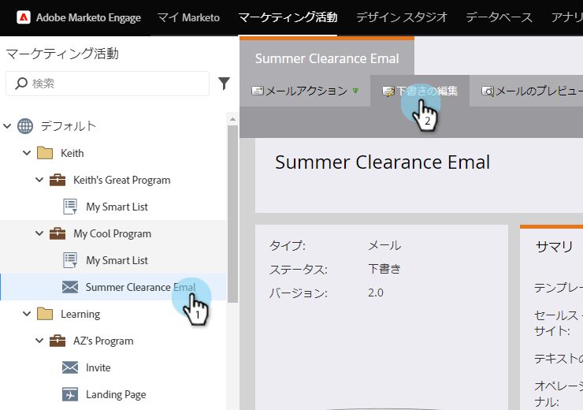

# 電子メ追加ール内のリンクとしてのシステムトークン {#add-a-system-token-as-a-link-in-an-email}

これらのシステムトークンを使用して、電子メール内の特別なリンクの位置をカスタマイズできます。

次のトークンは、電子メールまたは電子メールテンプレート内のリンクとして使用できます。

* `{{system.forwardToFriendLink}}`
* `{{system.unsubscribeLink}}`
* `{{system.viewAsWebpageLink}}`

>[!NOTE]
>
>これらのトークンは、アンカーリンク内でな **ければ** 、クリックできません。 また、マイトークンに埋め込むこ **とはできません** 。

電子メールに追加する方法を次に示します。

1. 電子メールを探して選択し、「ドラフトを **編集**」をクリックします。

   

1. 編集可能な領域内で重複を押しながらクリック

   

1. トークンを含むリンクに変換するテキストをハイライト表示し、「リンクを **挿入/編集** 」ボタンをクリックします。

   

1. 「リンクURL」にトークンを入力し、「 **挿入**」をクリックします。

   

   >[!TIP]
   >
   >必要なトークンをコピー/貼り付けます。 **`{{system.forwardToFriendLink}}`** または **`{{system.unsubscribeLink}}`** **`{{system.viewAsWebpageLink}}`**

1. 「 **保存**」をクリックします。

   

>[!NOTE]
>
>**Reminder**
>
>電子メールの [承認が完了したら、忘れずに](../../../../product-docs/email-marketing/general/creating-an-email/approve-an-email.md) 承認してください。

うまくいった！ これで、システムトークンを電子メール内のリンクとして追加する方法がわかりました。