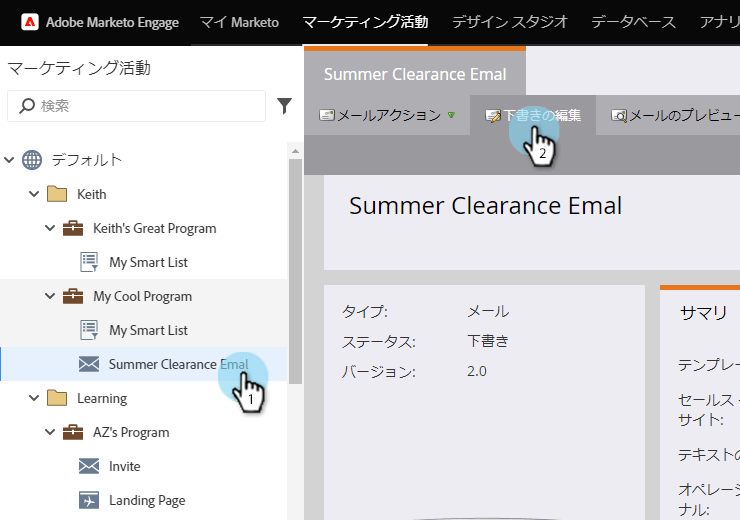
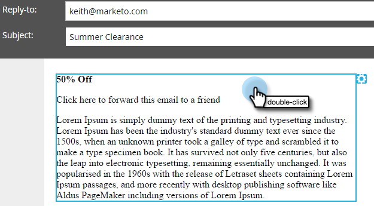
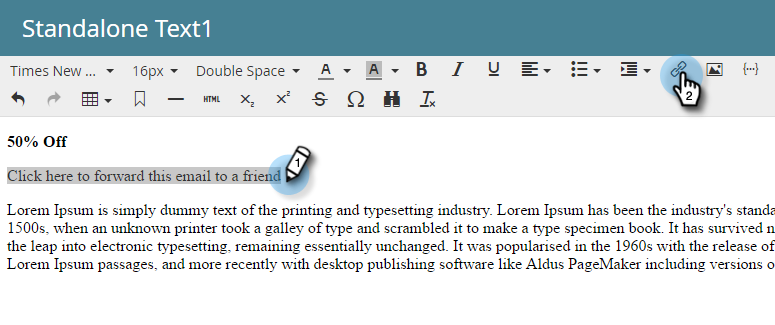
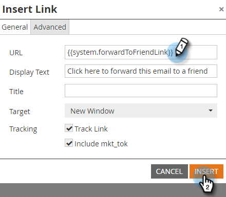
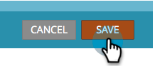

# メールにシステムトークンをリンクとして追加する {#add-a-system-token-as-a-link-in-an-email}

これらのシステムトークンを使用して、メール内の特別なリンクの位置をカスタマイズできます。

次のトークンは、メールまたはメールテンプレート内のリンクとして使用できます。

* `{{system.forwardToFriendLink}}`
* `{{system.unsubscribeLink}}`
* `{{system.viewAsWebpageLink}}`

>[!NOTE]
>
>これらのトークンは、アンカーリンク内にない限り、クリック&#x200B;**できません**。 また、マイトークンに埋め込むことも&#x200B;**できません**。

メールに追加する方法を次に示します。

1. メールを探して選択し、「**[!UICONTROL ドラフトを編集]**」をクリックします。

   

1. 編集可能な領域をダブルクリックします。

   

1. トークンを含むリンクに変換するテキストをハイライト表示し、「**[!UICONTROL リンクを挿入／編集]**」ボタンをクリックします。

   

1. 「リンク URL」にトークンを入力し、「**[!UICONTROL 挿入]**」をクリックします。

   

   >[!TIP]
   >
   >目的のトークン（**`{{system.forwardToFriendLink}}`**、**`{{system.unsubscribeLink}}`**、**`{{system.viewAsWebpageLink}}`** のいずれか）をコピー＆ペーストします。

1. 「**[!UICONTROL 保存]**」をクリックします。

   

>[!IMPORTANT]
>
>このアプローチを使用して「viewAsWebpageLink」システムトークンを追加する場合は、トークンを使用して&#x200B;**not**&#x200B;上書きできます。 代わりに、[メールに「Web ページとして表示」リンクを追加する](/help/marketo/product-docs/email-marketing/general/functions-in-the-editor/add-a-view-as-web-page-link-to-an-email.md)アプローチを使用すれば、トークンを使用して「viewAsWebPageLink」を上書きできます。

>[!NOTE]
>
>完了したら、忘れずに[メールを承認](/help/marketo/product-docs/email-marketing/general/creating-an-email/approve-an-email.md)してください。

これで完了です。 システムトークンをリンクとしてメールに追加する方法がわかりました。
