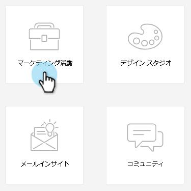
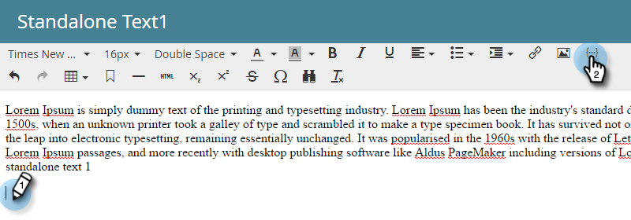

# メールにメールスクリプトトークンを追加する {#add-an-email-script-token-to-your-email}

[メールスクリプトを作成](/help/marketo/product-docs/email-marketing/general/using-tokens/create-an-email-script-token.md)したら、メールに追加して、実際に使用されている内容を確認できます。手順は以下のとおりです。

>[!NOTE]
>
>1 つのメールに挿入されるすべてのスクリプトトークンの合計サイズは 100 KB を超えてはなりません。

1. **マーケティングアクティビティ**&#x200B;領域に移動します。

   

1. トークンを追加するメールを見つけて選択し、「**ドラフトを編集**」をクリックします。

   

   >[!TIP]
   >
   >必要に応じて、トークンをメールテンプレートに追加することもできます。

1. トークンを追加する編集可能領域をダブルクリックします。

   

1. トークンを挿入する場所にカーソルを置き、トークンを挿入アイコンをクリックします。

   

1. 以前作成したメールスクリプトトークンを探して選択し、「**挿入**」をクリックします。

   

   >[!TIP]
   >
   >必要に応じて、デフォルト値を追加します。

1. 「**保存**」をクリックします。

   

>[!NOTE]
>
>忘れずに[メールを承認](/help/marketo/product-docs/email-marketing/general/creating-an-email/approve-an-email.md)してください。

これで完了です。このメールが送信されると、トークンの背後にあるスクリプトが実行され、コンテンツが設定されます。
