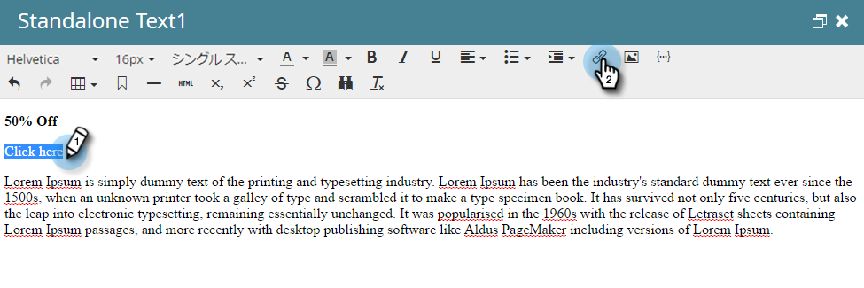

# 電子メ追加ールリンクへのトークン {#add-tokens-to-an-email-link}

リンクに追加のパラメーターや個人固有のパラメーターを挿入するには、トークンを使用します。 これが方法です。

1. 電子メールを選択し、「 **ドラフトを編集** 」タブをクリックします。

   

1. 編集可能な領域を重複キーを押しながらクリックします。

   

1. リンクのテキストを指定または書き込みます。 リンクをハイライト表示し、リンクの **挿入/編集** アイコンをクリックします。

   

1. 目的のトークンを **URLに入力し** 、「 **挿入**」をクリックします。

   

1. 「 **保存**」をクリックします。

   

   それだ！

>[!MORELIKETHIS]
>
>* [マイトークンでのURLの使用](using-urls-in-my-tokens.md)

>

