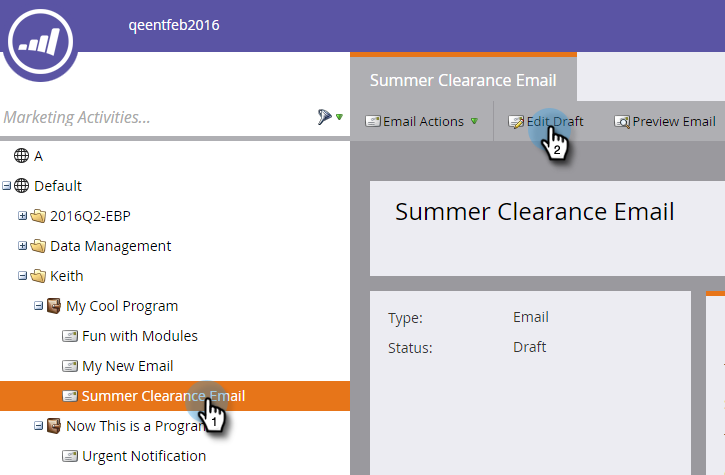
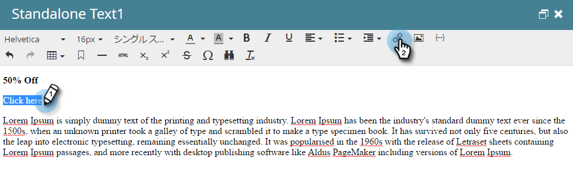

# メールリンクにトークンを追加する {#add-tokens-to-an-email-link}

リンクに追加のパラメーターやユーザー固有のパラメーターを挿入する場合は、トークンを使用できます。 手順は以下のとおりです。

1. メールを選択して「**[!UICONTROL ドラフトを編集]**」タブをクリックします。

   

1. 編集可能な領域をダブルクリックします。

   

1. リンクのテキストを指定または書き込みます。 ハイライト表示し、**[!UICONTROL リンクの挿入／編集]**&#x200B;アイコンをクリックします。

   

1. 目的のトークンを「**[!UICONTROL URL]**」に入力して、「**[!UICONTROL 挿入]**」をクリックします。

   

1. 「**[!UICONTROL 保存]**」をクリックします。

   

>[!MORELIKETHIS]
>
>[マイトークンでの URL の使用](/help/marketo/product-docs/email-marketing/general/using-tokens/using-urls-in-my-tokens.md)
