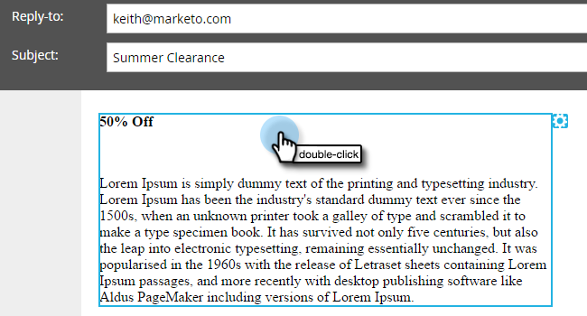

# 電子メールリンク追加へのトークン{#add-tokens-to-an-email-link}

リンクに追加のパラメーターや個人固有のパラメーターを挿入するには、トークンを使用します。 これが方法です。

1. 電子メールを選択し、「**ドラフトを編集**」タブをクリックします。

   

1. 編集可能な領域を重複キーを押しながらクリックします。

   

1. リンクのテキストを指定または書き込みます。 ハイライト表示し、**リンクを挿入/編集**&#x200B;アイコンをクリックします。

   

1. **URL**&#x200B;に目的のトークンを入力し、**挿入**&#x200B;をクリックします。

   

1. 「**保存**」をクリックします。

   

   それだ！

>[!MORELIKETHIS]
>
>[マイトークンでのURLの使用](/help/marketo/product-docs/email-marketing/general/using-tokens/using-urls-in-my-tokens.md)
