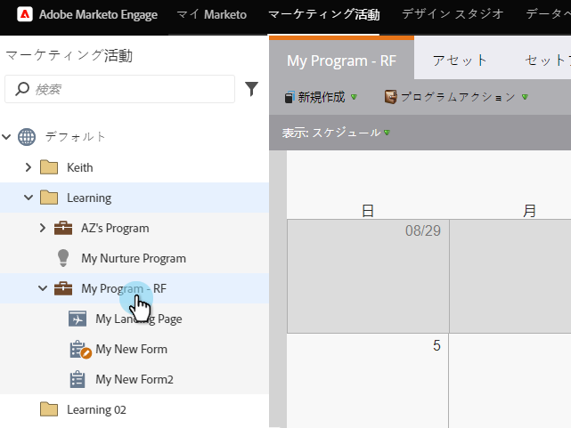
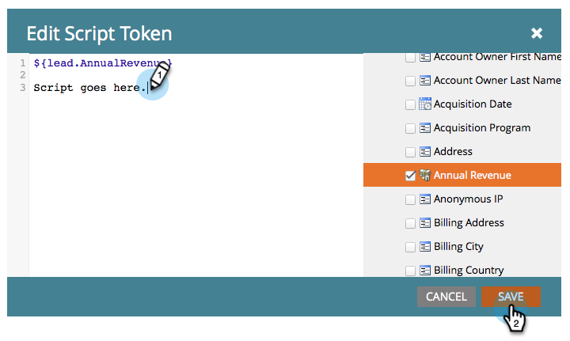

# メールスクリプトトークンを作成する {#create-an-email-script-token}

上級の開発者は、メールで [Velocity スクリプト](https://velocity.apache.org/engine/1.7/user-guide.html)を使用できます。その方法を説明しましょう。

1. 「**マーケティングアクティビティ**」に移動します。

   

1. 任意のプログラム（イベント、デフォルト、エンゲージメントなど）を選択します。

   

1. 「**マイトークン**」タブで、**メールスクリプト**&#x200B;トークンをドラッグします。

   

1. メールスクリプトトークンに名前を付け、**クリックして内容を編集**&#x200B;します。

   

1. 右側のツリーを使用して、**リード、商談**、または&#x200B;**カスタムオブジェクト**&#x200B;トークンをドラッグします。

   

   >[!NOTE]
   >
   >配列（商談またはカスタムオブジェクト）にアクセスする場合、そのリードに関連付けられた最新の 10 個の項目に制限されます。

1. トークンをスクリプトエディターにドラッグすると、トークンがチェックされ、アクティブになります。

   

   >[!NOTE]
   >
   >トークンを自由形式で入力する場合は、ツリー内の対応するトークンすべてにチェックを付ける（つまり、有効化する）のを忘れないようにしてください。そうしないと、プレーンテキストとして処理され、正しく機能しません。

1. Velocity でスクリプトを作成します。以下に、役立つリソースを示します。

   * [Marketo 開発者向けメールスクリプティングのドキュメント](https://developers.marketo.com/email-scripting/)
   * [Velocity ユーザーガイド](https://velocity.apache.org/engine/devel/user-guide.html)
   * [Velocity リファレンスガイド](https://velocity.apache.org/engine/devel/vtl-reference-guide.html)
   * [Velocity ツール Javadoc](https://velocity.apache.org/tools/releases/2.0/javadoc/index.html)

1. スクリプトが完了したら、「**保存**」をクリックします。

   

1. 「**保存**」をもう 1 回クリックします。

   

これで、このトークンをメールで使用できます。メールが送信されるたびにスクリプトが実行されます。

>[!MORELIKETHIS]
>
>[メールにメールスクリプトトークンを追加する](/help/marketo/product-docs/email-marketing/general/using-tokens/add-an-email-script-token-to-your-email.md)>
>
