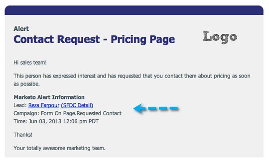
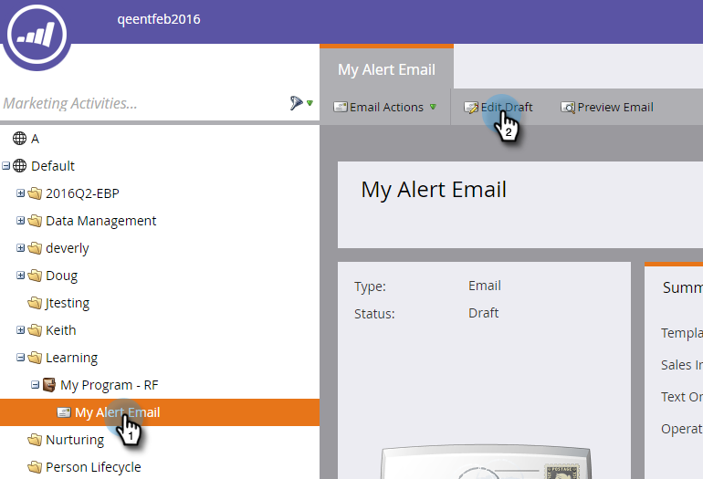
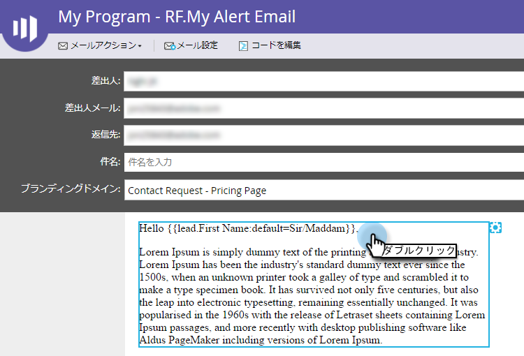
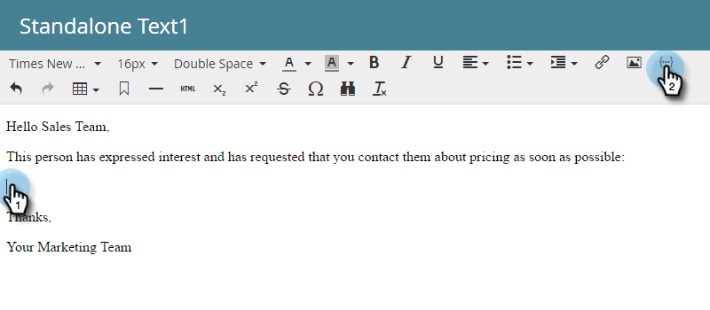
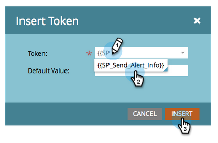
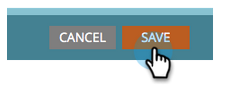

# アラート情報送信トークンの使用 {#use-the-send-alert-info-token-sp-send-alert-info}

`{{SP_Send_Alert_Info}}` トークンは、セールスチームのアラートメールを作成する際に使用する特別なトークンです。

>[!TIP]
>
>このトークンは、そのトークンを含むメールを[アラートを送信](/help/marketo/product-docs/core-marketo-concepts/smart-campaigns/flow-actions/send-alert.md)フローステップで送信する場合のみに機能します。 Send Email フローステップで使用された場合は機能しません。

アラートの例：

>[!NOTE]
>
>ご注意ください。 アラート内の URL には有効期限があるので、これらのタイプのメッセージをサポートするケイデンスが設定されていることを確認してください。 有効期限は[管理者が設定](/help/marketo/product-docs/administration/settings/edit-link-expiration-in-reports-and-alerts.md)します。

以下の情報が `{{SP_Send_Alert_Info}}` の一部として含まれています。

* Marketo の人物詳細へのリンクとして表示される名と姓
* CRM 内の人物へのリンク
* アラートを送信した Marketo のキャンペーン名
* アラートが送信された時刻

>[!NOTE]
>
>CRM へのリンクは、その人物が CRM システムに存在する場合にのみ表示されます（現在は Dynamics CRM では使用できません）。 このリンクには、Marketo ユーザーと Marketo 以外のユーザーの両方がアクセスできます。

## SP_Send_Alert_Info トークンをメールに追加する {#add-the-sp-send-alert-info-token-to-an-email}

1. メールを選択して、「**[!UICONTROL ドラフトを編集]**」をクリックします。

   

1. トークンを追加する編集可能領域をダブルクリックします。

   

1. トークンを配置する場所にカーソルを置き、「**[!UICONTROL トークンを挿入]**」ボタンをクリックします。

   

1. **[!UICONTROL `{{SP_Send_Alert_Info}}`]** トークンを検索して選択し、「**[!UICONTROL 挿入]**」をクリックします。

   

1. 「**[!UICONTROL 保存]**」をクリックします。

   

>[!NOTE]
>
>忘れずにメールを承認してください。

これは強力です。 このトークンは非常に役に立つので、セールスチーム向けに作成するすべてのアラートで使用してください。
