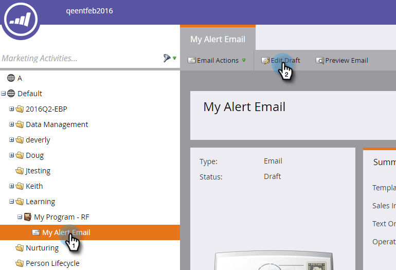

# アラート情報トークンの送信の使用 {#use-the-send-alert-info-token-sp-send-alert-info}

トー `{{SP_Send_Alert_Info}}` クンは、セールスチーム向けのアラート電子メールを作成する際に使用する特別なトークンです。

>[!NOTE]
>
>**FYI**
>
>Marketoは現在、すべての購読で言語を標準化しているので、購読およびdocs.marketo.comの人物/人物にリード/リードを表示できます。 これらの用語は同じことを意味し、記事の説明には影響しません。 他にも変化がある。 [詳細情報](http://docs.marketo.com/display/DOCS/Updates+to+Marketo+Terminology)。

>[!TIP]
>
>このトークンは、 [Send Alert](../../../../product-docs/core-marketo-concepts/smart-campaigns/flow-actions/send-alert.md) Flow手順を含む電子メールを送信する場合にのみ意図したとおりに機能します。 「電子メールの送信」フローステップで使用する場合は機能しません。

アラートの例：   

>[!NOTE]
>
>立て！ アラート内のURLには有効期限があるので、これらのタイプのメッセージをサポートするカデンスがあることを確認してください。 有効期限は管理者が [設定します](../../../../product-docs/administration/settings/edit-link-expiration-in-reports-and-alerts.md)。

には、次の情報が含まれていま `{{SP_Send_Alert_Info}}`す。

* マーケティング担当者の詳細へのリンクとしての名と姓
* CRM内のユーザーへのリンク
* アラートを送信したマーケティング担当者のキャンペーン名。
* アラートが送信された時刻

>[!NOTE]
>
>CRMへのリンクは、そのユーザーがCRMシステムにいる場合（現在、Dynamics CRMでは利用できません）にのみ表示されます。 リンクは、マーケティング担当者と非マーケティング担当者の両方のユーザーがアクセスできます。

## SP_追加Send_Alert_Infoトークンを電子メールに送信 {#add-the-sp-send-alert-info-token-to-an-email}

1. 電子メールを選択し、「ドラフトを **編集**」をクリックします。

   

1. トークンを追加する編集可能領域を重複キーを押しながらクリックします。

   

1. トークンを挿入する場所にカーソルを置き、「トークンの **挿入** 」ボタンをクリックします。

   

1. トークンを探して選択し、「 **`{{SP_Send_Alert_Info}}`** Insert ****」をクリックします。

   

1. 「 **保存**」をクリックします。

   

>[!NOTE]
>
>**Reminder**
>
>メールを承認するのを忘れないでください。

いい物だ！ このトークンは非常に役立つので、営業チームに対して作成するすべてのアラートで使用する必要があります。