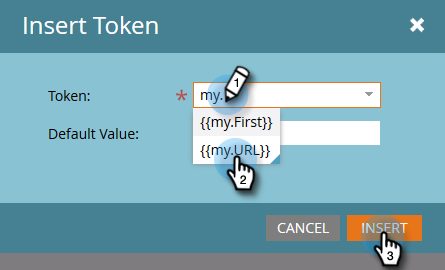

# マイトークンでの URL の使用 {#using-urls-in-my-tokens}

以下の手順に従って、[!UICONTROL  マイトークン ] を使用して、メールに URL を挿入します。

1. プログラムを選択し、「**[!UICONTROL マイトークン]**」をクリックします。

   

1. 「**[!UICONTROL テキスト]**&#x200B;マイトークンを」選択して、キャンバスにドラッグ＆ドロップします。

   

1. トークンに一意の名前を付け、URL（https:// を除く）を入力して、「**[!UICONTROL 保存]**」をクリックします。

   

   >[!CAUTION]
   >
   >**http／https… の使用**
   >
   >* メール内でクリック数が確実に追跡されるようにするには、トークンの値&#x200B;_内_&#x200B;に https:// と入力&#x200B;**しない**&#x200B;でください。 手順 7 に示すように、トークン外で使用します。
   >
   >* http／https を除外しないことを強くお勧めします。 これにより、メールの [web バージョン](/help/marketo/product-docs/email-marketing/general/functions-in-the-editor/add-a-view-as-web-page-link-to-an-email.md){target="_blank"}が正しくレンダリングされない可能性があります。

1. プログラム内のメールを選択します。

   

1. 「**[!UICONTROL ドラフトを編集]**」をクリックします。

   

1. 編集するテキスト領域をダブルクリックします。

   

1. メールの任意の場所で、`https://` と入力し（後ろにスペースを残さず）、トークンを挿入アイコンをクリックします。

   

   >[!NOTE]
   >
   >もちろん、サイトで「https」を使用しない場合は、`http://` を入力することもできます。

1. マイトークンを探し、選択して、「**[!UICONTROL 挿入]**」をクリックします。

   

1. https:// とトークンをハイライト表示し、Ctrl+X（Windows）またはCmd+X（Mac）を押してテキストを切り取ります。

   

1. リンクを表示するテキストをハイライト表示し、「[!UICONTROL  リンクを挿入/編集 ]」アイコンをクリックします。

   

1. Ctrl/Cmd+V を押して、内容を「**[!UICONTROL URL]**」ボックスにペーストして「**[!UICONTROL 挿入]**」をクリックします。

   

1. 「**[!UICONTROL 保存]**」をクリックします。

   

   これで完了です。 送信後に URL が自動入力されます。https://をトークンの前に置くことで、トラッキング可能なリンクが生成されます。
