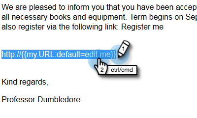

# マイトークンでのURLの使用 {#using-urls-in-my-tokens}

次の手順に従って、マイトークンを使用して電子メールにURLを挿入します。

1. プログラムを選択し、「 **マイトークン**」をクリックします。

   

1. 「 **テキスト** マイトークン」を選択し、カンバスにドラッグ&amp;ドロップします。

   

1. トークンに一意の名前を付け、URL(http://は除く)を入力し、「 **保存**」をクリックします。

   

   >[!CAUTION]
   >
   >電子メール内でクリックを確実に追跡するために、トークンの値内にhttp:// **を入力しないでください** 。

1. プログラムーで電子メールを選択します。

   

1. 「ドラフト **を編集**」をクリックします。

   

1. 編集するテキスト領域内で重複を押しながらクリックします。

   

1. 電子メール内の任意の場所で、「http://」と入力し（後ろにスペースを残さず）、「Insert Token」アイコンをクリックします。

   

   >[!NOTE]
   >
   >もちろん、サイトで「https」を使用する場合は、「https」を入力することもできます。

1. マイトークンを探し、選択して「 **挿入**」をクリックします。

   

1. http://とトークンをハイライト表示し、Ctrl/Command+X(Ctrl = Windows/Cmd = Mac)を押してテキストを切り取ります。

   

1. リンクを表示するテキストをハイライト表示し、リンクの挿入/編集アイコンをクリックします。

   

1. CtrlまたはCommandキーを押しながらVキーを押して「 **URL** 」ボックスにコンテンツを貼り付け、「 **挿入**」をクリックします。

   

1. 「 **保存**」をクリックします。

   

   終わった！ URLは送信後に設定され、http://をトークンの前に置いたおかげで、トラッキング可能なリンクが生成されます。

