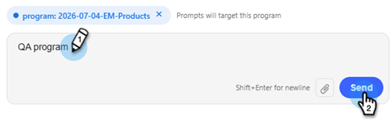

# プログラム QA {#program-qa}

メール、ランディングページ、キャンペーンなど、あらゆるコンポーネントをまたいでベストプラクティスのプログラムを監査します。

>[!NOTE]
>
>この機能はオープンベータ版で、現在数か月にわたって段階的に展開されています。 My Marketo画面に&#x200B;_AIでビルド_ タイルが表示されたら、サブスクリプションが有効になったときにわかります。

## 使用方法 {#how-to-use}

1. マイMarketoで、**AIでビルド** タイルをクリックします。

   

1. **プログラム QA** エージェントを選択します。

   

   会話型AI画面が表示されます。

1. 右側のパネルで、QAを行うプログラムを選択します。

   {width="800" zoomable="yes"}

   プログラムの概要が中央のパネルに表示され、プログラムの概要が表示されます。

   {width="450" zoomable="yes"}

1. プロンプトウィンドウで、「QA プログラム」と入力し、**送信**&#x200B;をクリックします。

   

   AI アシスタントが選択したプログラムのQAを表示し、何が合格し、何が失敗したかを示します。

   

<!--
   You have three validation paths to choose from:

   | Path | What You Provide | Verification Type | Best For |
   | --- | --- | --- | --- |
   | Rules Only | Nothing | Compliance checks | Org compliance & audits |
   | + Test Plan | Your team's test document | Rules + Custom checks | Team or channel-specific checks |
   | + Campaign Brief | Campaign brief document | Exact field matching | Pre-launch readiness |

1. To Upload a Test Plan, a Campaign Brief, or both, click the upload icon, add your files and click **Send**. To proceed with rules only, enter "Proceed with Rules Only" in the prompt window and click **Send**. In this example, we are proceeding with rules only.

PICC

1. To start validation, click **Run QA Validation**.

PICC

1. The report generates. To see the full report, click View Full Report.

PICC

1. The report appears in the center console. Scroll down to view. You can also download the report via .docx file.

PICC
-->
