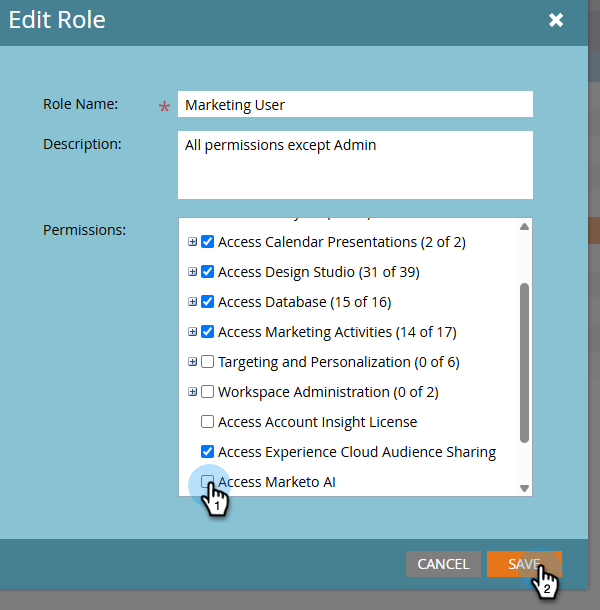

# 設定と設定 {#settings-setup}

権限を有効にし、設定エリアを使用して接続の詳細を表示し、組織ルールを定義し、統合と通知を設定する方法を説明します。

## 権限 {#permissions}

>[!IMPORTANT]
>
>Marketo AIのAlpha フェーズでは、管理者、Adobe製品管理者、マーケティングユーザー、標準ユーザーの役割に対して、_アクセスがデフォルトで_&#x200B;有効になっています。 したがって、アクセス権を持つ役割に対してオンにする代わりに、自分がオフにしている役割に対してオフにする必要があります。

### すべての人にアクセス {#access-for-all}

上記のすべての役割に対してMarketo AIを有効にしたい場合は、何もする必要はありません。

### 一部のユーザーへのアクセス {#access-for-some}

役割のアクセス権を削除する場合は、次の手順に従います。

1. マイMarketoで、**管理者**、**ユーザーと役割**&#x200B;の順にクリックします。

   

1. 「_役割_」タブで、目的の役割を選択し、**役割を編集**&#x200B;をクリックします。

   

1. 下にスクロールして、「**AIを使用してビルドにアクセス**」チェックボックスのチェックを外し、**保存**」をクリックします。__

   

他の必要な役割に対してこれらの手順を繰り返します。

### カスタム役割 {#custom-role}

また、[新しい役割](https://experienceleague.adobe.com/ja/docs/marketo/using/product-docs/administration/users-and-roles/create-delete-edit-and-change-a-user-role#create-a-role){target="_blank"}を作成し、その権限をカスタマイズして、_AIを使用してビルドにアクセス_&#x200B;を追加し、その他の任意の役割を[特定のユーザーに割り当てるオプションもあります。](https://experienceleague.adobe.com/ja/docs/marketo/using/product-docs/administration/users-and-roles/managing-user-roles-and-permissions#assign-roles-to-a-user){target="_blank"}

<!-- 
## Permissions {#permissions}

In order to access Marketo AI, Admins must first enable role permissions. 

1. In your My Marketo, click **Admin**, then **Users & Roles**.

   

1. In the _Roles_ tab, select the desired role and click **Edit Role**.

   

1. Scroll down and select the **Access Build with AI** checkbox and click **Save**.

   

-->

## 設定 {#settings}

1. マイMarketoで、**AIでビルド** タイルをクリックします。

   

1. 歯車アイコンをクリックします。

   

### 接続 {#connection}

このタブには編集可能なフィールドが含まれていません。 Munchkin IDやIMS組織などのアカウント情報が表示されます。

### 組織ルール {#organizational-rules}

Marketo Engage アセットを作成または修正する際に、Marketo AIが従う組織ガイドラインと制約を定義します。

{width="800" zoomable="yes"}

>[!NOTE]
>
>ルールは、YAML frontmatterでMarkdown形式を使用します。 グローバルルールはすべてのワークスペースに適用されます。 Workspace ルールは、グローバル設定を上書きします。

### 統合（近日公開予定） {#integrations}

外部サービスおよびAPIへの接続を設定します。

_このタブはUIに表示されますが、まだ使用できません。 更新プログラム_&#x200B;を確認してください。

### 通知（近日リリース予定） {#notifications}

アラートの環境設定と通知チャネルを管理します。

_このタブはUIに表示されますが、まだ使用できません。 更新プログラム_&#x200B;を確認してください。
