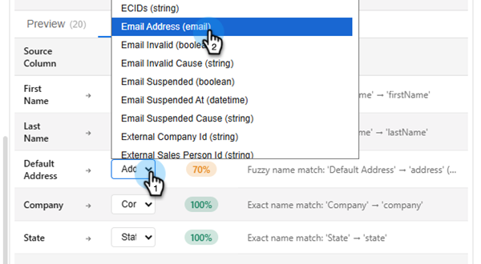

# リードの読み込み {#import-leads}

フィールドマッピング機能を利用すれば、リードリストをMarketo Engageデータベースにインポートして重複を排除できます。

>[!AVAILABILITY]
>
>この機能は現在オープンベータ版です。 アクセスをリクエストするには、アカウントマネージャーにお問い合わせください。 また、[&#x200B; コア生成AIの利用条件および補足条件](https://www.adobe.com/legal/terms/enterprise-licensing/genai-ww.html){target="_blank"}に同意する必要があります。

## 使用方法 {#how-to-use}

1. マイMarketoで、**Marketo AI** タイルをクリックします。

   

1. **リードの読み込み** エージェントをクリックします。

   

   会話型AI画面が表示されます。 左側のペインには、ガイダンス、応答、使用可能なデータの正規化オプションが表示されます。

   

1. リードの読み込みを開始するには、添付ファイルアイコンをクリックし、.CSV ファイルを介してアップロードします。

   

1. 「リストの読み込み」と入力し、**送信**&#x200B;をクリックします。

   

   リストがセンターコンソールでプレビューされます。

   

1. 目的のビジネスルールを入力し、**送信**&#x200B;をクリックします。

   

   結果はセンターコンソールに表示されます。

   

   必要に応じて、追加のビジネスルールを入力します。

1. マッピングされたフィールドを表示するには、「**マッピング**」タブをクリックします。

1. フィールドが正しくマッピングされていない場合は、ここで修正します。

   

1. リストを読み込む準備ができたら、「**Marketoに読み込み**」タブをクリックします。

1. 宛先フォルダーを選択し、名前を入力します。 各同意ボックスにチェックを入れ、**承認してMarketoに読み込む**&#x200B;をクリックします。

   

読み込みが完了すると、検証概要が表示され、処理されたリード、失敗した行、警告が表示されます。

