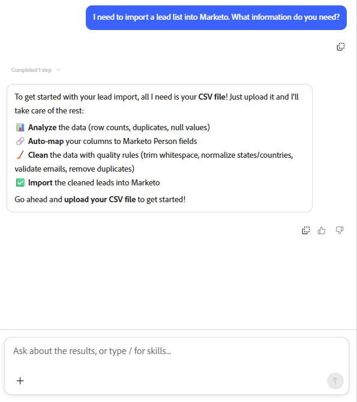
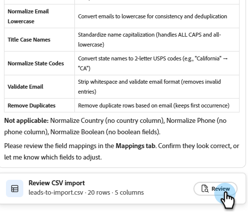
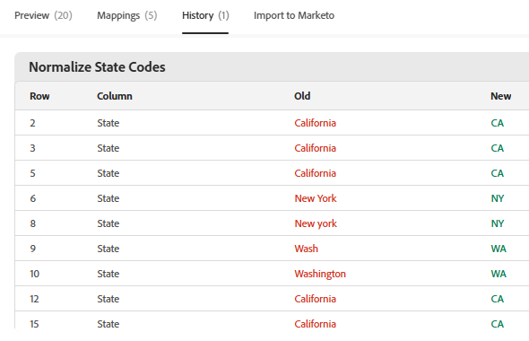

# リードの読み込み {#import-leads}

フィールドマッピング機能を利用すれば、リードリストをMarketo Engageデータベースにインポートして重複を排除できます。

## 使用方法 {#how-to-use}

1. マイMarketoで、**Marketo AI** タイルをクリックします。

   

1. **リードの読み込み** エージェントをクリックします。

   

   会話型AI画面が表示されます。 左側のペインには、ガイダンス、応答、使用可能なデータの正規化オプションが表示されます。

   

1. リードの読み込みを開始するには、**+** アイコンをクリックし、**ファイルをアップロード**&#x200B;を選択します。 CSV ファイルを検索してアップロードします。

   

1. 上矢印アイコンをクリックします。

   

1. 「**レビュー**」をクリックして、センターコンソールにリストを表示します。

   

1. 利用可能なビジネスルールを確認して、リストをクリーンアップします。 目的のものを入力し、上向き矢印アイコンをクリックします。

   

   結果はセンターコンソールに表示されます。

   

   必要に応じて、追加のビジネスルールを入力します。

1. マッピングされたフィールドを表示するには、「**マッピング**」タブをクリックします。

1. いずれかのフィールドが正しくマッピングされていない場合は、**ターゲットフィールド**&#x200B;を変更して、ここに修正します。

   

1. リストを読み込む準備ができたら、「**Marketoに読み込み**」タブをクリックします。

1. 宛先フォルダーを選択し、名前を入力します。 各同意ボックスにチェックを入れ、**インポートを開始**&#x200B;をクリックします。

   

   読み込みが完了すると、検証概要が表示され、処理されたリード、失敗した行、警告が表示されます。
