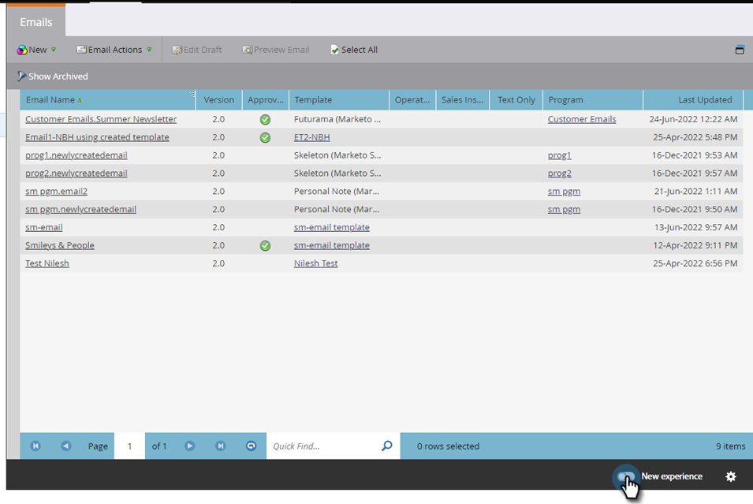

# 切替スイッチ {#toggle-switch}

切り替えスイッチを使用すると、Marketoのクラシックインターフェイスと Modern UX を切り替えることができます。 以下に示すすべての領域で使用できます。

>[!NOTE]
>
>切替スイッチを選択すると、UI が変更される前に、既存のすべてのワークフローが自動保存されます。操作が既に進行中の場合（例：アセットが承認中）の場合は、その旨を示すエラーメッセージが表示され、操作が完了した後にもう一度やり直す必要があります。

## 個々のロールの切り替えスイッチの有効化 {#enable-the-toggle-switch-for-individual-roles}

個々の役割またはすべての役割の切り替えスイッチを有効にします。 手順は以下のとおりです。

1. Marketo Engageで、 **管理者**.

   

1. クリック **新しいエクスペリエンス**.

   

1. 切り替えスイッチにアクセスする役割を選択します。

   

## 機能を有効にする {#enable-for-features}

個々の機能（現在および今後リリース予定）に対してMarketo Engageモダン UX を手動で有効にするオプションも、すべての使用可能な機能（現在および今後）を有効にするオプションも用意されています。

現在切り替えスイッチがある領域（この例では、電子メールリスト表示）で、ページの右下にある切り替えボタンをクリックします。

新しいエクスペリエンスが読み込まれます。

有効にする手順は次のとおりです。 _すべて_ 機能を使用する場合は、切り替えスイッチの横にある歯車アイコンをクリックします。

「**使用可能なすべての機能で有効にする**」を選択して、「**OK**」をクリックします。

## 利用可能な機能 {#available-features}

現在、Modern UX では次の機能を使用できます（各リリースに新機能が追加されています）。

* メールの詳細表示
* メールリスト表示
* メールテンプレートの詳細ビュー
* メールテンプレートリスト
* メールテストダッシュボードビュー
* フォームの詳細表示
* フォームリスト表示
* 画像とファイルの詳細ページ
* ランディングページの詳細ビュー
* ランディングページのリスト表示
* ランディングページテンプレートの詳細
* スニペット詳細表示

