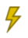

# 新しいアイコンの用語集{#new-icon-glossary}

新しいAdobeMarketo Engageインターフェイスの新しいアイコンは、次のとおりです。 まだMarketo Classicを使っている場合は、[ここ](/help/marketo/getting-started/icon-glossary.md)にアイコンの用語集があります。

## 一般的なアイコン{#general-icons}

<table> 
 <tbody>
  <tr>
   <th>古いアイコン</th> 
   <th> 新規アイコン</th> 
   <th>説明</th> 
  </tr>
  <tr>
   <td><strong>該当なし</strong></td> 
   <td></td> 
   <td>アカウントスマートリスト</td> 
  </tr>
  <tr>
   <td></td> 
   <td></td> 
   <td>バッチキャンペーン — アクティブ</td> 
  </tr>
  <tr>
   <td></td> 
   <td></td> 
   <td>バッチキャンペーン — 非アクティブ</td> 
  </tr>
  <tr>
   <td></td> 
   <td></td> 
   <td>デフォルトのプログラム</td> 
  </tr>
  <tr>
   <td></td> 
   <td></td> 
   <td>メール</td> 
  </tr>
  <tr>
   <td></td>
   <td></td> 
   <td>メールプログラム</td> 
  </tr>
  <tr>
   <td></td> 
   <td></td> 
   <td>メールテンプレート</td> 
  </tr>
  <tr>
   <td></td> 
   <td></td> 
   <td>エンゲージメントプログラム</td> 
  </tr>
  <tr>
   <td></td> 
   <td></td> 
   <td>イベントプログラム</td> 
  </tr>
  <tr>
   <td></td> 
   <td></td> 
   <td>Executable Campaign</td> 
  </tr>
  <tr>
   <td></td> 
   <td></td> 
   <td>フィールド オーガナイザ</td> 
  </tr>
  <tr>
   <td></td> 
   <td></td> 
   <td>フィルター</td> 
  </tr>
  <tr>
   <td><strong>該当なし</strong></td> 
   <td></td> 
   <td>フィルタ — アクティブ</td> 
  </tr>
  <tr>
   <td></td> 
   <td></td> 
   <td>フォルダ</td> 
  </tr>
  <tr>
   <td></td> 
   <td></td> 
   <td>フォルダ — アーカイブ済み</td> 
  </tr>
  <tr>
   <td></td> 
   <td></td> 
   <td>フォルダ — ロック</td> 
  </tr>
  <tr>
   <td></td> 
   <td></td> 
   <td>フォーム</td> 
  </tr>
  <tr>
   <td></td> 
   <td></td> 
   <td>画像（およびファイル）</td> 
  </tr>
  <tr>
   <td></td> 
   <td></td> 
   <td>アプリ内メッセージ</td> 
  </tr>
  <tr>
   <td></td> 
   <td></td> 
   <td>アプリ内プログラム</td> 
  </tr>
  <tr>
   <td></td> 
   <td></td> 
   <td>ランディングページ</td> 
  </tr>
  <tr>
   <td></td> 
   <td></td> 
   <td>ランディングページ テンプレート</td> 
  </tr>
  <tr>
   <td></td> 
   <td></td> 
   <td>モデル</td> 
  </tr>
  <tr>
   <td></td> 
   <td></td> 
   <td>投票</td> 
  </tr>
  <tr>
   <td></td> 
   <td></td> 
   <td>プッシュ通知</td> 
  </tr>
  <tr>
   <td></td> 
   <td></td> 
   <td>紹介オファー</td> 
  </tr>
  <tr>
   <td></td> 
   <td></td> 
   <td>レポート</td> 
  </tr>
  <tr>
   <td><strong>該当なし</strong></td> 
   <td></td> 
   <td>検索</td> 
  </tr>
  <tr>
   <td></td> 
   <td></td> 
   <td>セグメント</td> 
  </tr>
  <tr>
   <td></td> 
   <td></td> 
   <td>スマート リスト</td> 
  </tr>
  <tr>
   <td></td> 
   <td></td> 
   <td>スマートリスト — キャッシュ</td> 
  </tr>
  <tr>
   <td></td> 
   <td></td> 
   <td>SMS メッセージ</td> 
  </tr>
  <tr>
   <td></td> 
   <td></td> 
   <td>スニペット</td> 
  </tr>
  <tr>
   <td></td> 
   <td></td> 
   <td>SNS ボタン</td> 
  </tr>
  <tr>
   <td></td> 
   <td></td> 
   <td>静的リスト</td> 
  </tr>
  <tr>
   <td></td> 
   <td></td> 
   <td>懸賞</td> 
  </tr>
  <tr>
   <td></td> 
   <td></td> 
   <td>テスト グループ</td> 
  </tr>
  <tr>
   <td></td> 
   <td></td> 
   <td>トリガー — アクティブ</td> 
  </tr>
  <tr>
   <td><strong>該当なし</strong></td> 
   <td></td> 
   <td>トリガー — 非アクティブ</td> 
  </tr>
  <tr>
   <td></td> 
   <td></td> 
   <td>ワークスペース</td> 
  </tr>
  <tr>
   <td></td> 
   <td></td> 
   <td>YouTube 動画</td> 
  </tr>
 </tbody>
</table>

## バッチ キャンペーン {#batch-campaigns}

<table> 
 <tbody>
  <tr>
   <th>古いアイコン</th> 
   <th> 新規アイコン</th> 
   <th>説明</th> 
  </tr>
  <tr>
   <td></td> 
   <td></td> 
   <td>実行済み、次回なし</td> 
  </tr>
  <tr>
   <td></td> 
   <td></td> 
   <td>無効</td> 
  </tr>
  <tr>
   <td></td> 
   <td></td> 
   <td>未実行</td> 
  </tr>
  <tr>
   <td></td> 
   <td></td> 
   <td>実行中、待機中</td> 
  </tr>
  <tr>
   <td></td> 
   <td></td> 
   <td>実行スケジュール</td> 
  </tr>
  <tr>
   <td></td> 
   <td></td> 
   <td>再実行のスケジュール</td> 
  </tr>
  <tr>
   <td></td> 
   <td></td> 
   <td>Nurtureで使用</td> 
  </tr>
 </tbody>
</table>

## トリガーキャンペーン {#trigger-campaigns}

<table> 
 <tbody>
  <tr>
   <th>古いアイコン</th> 
   <th> 新規アイコン</th> 
   <th>説明</th> 
  </tr>
  <tr>
   <td></td> 
   <td></td> 
   <td>アクティブ</td> 
  </tr>
  <tr>
   <td></td> 
   <td></td> 
   <td>要求済み</td> 
  </tr>
  <tr>
   <td><strong>該当なし</strong></td> 
   <td></td> 
   <td>非アクティブ</td> 
  </tr>
  <tr>
   <td></td> 
   <td></td> 
   <td>無効</td> 
  </tr>
 </tbody>
</table>

## メールプログラム {#email-programs}

<table> 
 <tbody>
  <tr>
   <th>古いアイコン</th> 
   <th> 新規アイコン</th> 
   <th>説明</th> 
  </tr>
  <tr>
   <td></td> 
   <td></td> 
   <td>中止</td> 
  </tr>
  <tr>
   <td></td> 
   <td></td> 
   <td>完了済み</td> 
  </tr>
  <tr>
   <td></td> 
   <td></td> 
   <td>未承認</td> 
  </tr>
  <tr>
   <td></td> 
   <td></td> 
   <td>予定されています</td> 
  </tr>
 </tbody>
</table>

## エンゲージメント プログラム {#engagement-programs}

<table> 
 <tbody>
  <tr>
   <th>古いアイコン</th> 
   <th> 新規アイコン</th> 
   <th>説明</th> 
  </tr>
  <tr>
   <td></td> 
   <td></td> 
   <td>Off</td> 
  </tr>
  <tr>
   <td></td> 
   <td></td> 
   <td>オン</td> 
  </tr>
 </tbody>
</table>

## アプリ内プログラム {#in-app-programs}

<table> 
 <tbody>
  <tr>
   <th>古いアイコン</th> 
   <th> 新規アイコン</th> 
   <th>説明</th> 
  </tr>
  <tr>
   <td></td> 
   <td></td> 
   <td>承認済み</td> 
  </tr>
  <tr>
   <td></td> 
   <td></td> 
   <td>Not Configured Yet</td> 
  </tr>
  <tr>
   <td></td> 
   <td></td> 
   <td>Paused</td> 
  </tr>
  <tr>
   <td><strong>該当なし</strong></td> 
   <td></td> 
   <td>予定されています</td> 
  </tr>
  <tr>
   <td></td> 
   <td></td> 
   <td>停止しています</td> 
  </tr>
 </tbody>
</table>

## アセット {#assets}

<table> 
 <tbody>
  <tr>
   <th>古いアイコン</th> 
   <th> 新規アイコン</th> 
   <th>説明</th> 
  </tr>
  <tr>
   <td></td> 
   <td></td> 
   <td>承認済み</td> 
  </tr>
  <tr>
   <td></td> 
   <td></td> 
   <td>下書き</td> 
  </tr>
  <tr>
   <td></td> 
   <td></td> 
   <td>承認済み 下書き</td> 
  </tr>
 </tbody>
</table>

## セグメント {#segments}

<table> 
 <tbody>
  <tr>
   <th>古いアイコン</th> 
   <th> 新規アイコン</th> 
   <th>説明</th> 
  </tr>
  <tr>
   <td><strong>該当なし</strong></td> 
   <td></td> 
   <td>承認済み — 計算中</td> 
  </tr>
  <tr>
   <td><strong>該当なし</strong></td> 
   <td></td> 
   <td>承認済 — 再計算中</td> 
  </tr>
  <tr>
   <td><strong>該当なし</strong></td> 
   <td></td> 
   <td>ドラフト — 計算中</td> 
  </tr>
 </tbody>
</table>
