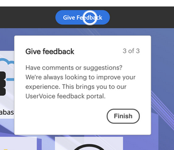

# 概要 {#overview}

次世代のMarketo Engageエクスペリエンスをご利用いただき、Marketoプラットフォーム全体の新しいルック&amp;フィールと共に、使い勝手の向上を提供する新しいインターフェイスをご利用いただけます。

>[!PREREQUISITES]
>
>ITチームがMarketoを使用したWebアクセスを制限し許可リストている場合は、すべてのリソースとWebソケットを許可するために、次のドメイン（アスタリスクを含む）を追加するように依頼してください。
>
>* *.marketo.com
>* *.marketodesigner.com
>* *.mktoweb.com

## ツアー{#take-the-tour}

最初のログイン時にポップアップが表示され、新しいエクスペリエンスの概要を確認できます。 スキップする場合は、**後で**&#x200B;使用できなくなります。

ツアーは知りたいことを全て伝える！

## 新機能{#whats-new}

この次世代のエクスペリエンスには多くの新機能があり、そのすべてがマーケティング体験を大幅に改善するように設計されています。

**アイコン**

新しいインターフェイスでは、アイコンの作成と拡張が行われました。 詳しくは、次を参照してください。[新しいアイコンの用語集](/help/marketo/product-docs/marketo-engage-next-generation-experience/new-icon-glossary.md)。

**グローバルナビゲーション**

さようならスーパーボール。 Marketoの主要セクションをすべてすばやく利用できるようになりました。

**インスタンスURL**

また、munchkin IDにすばやくアクセスでき、これがインスタンスのURLに反映されます(複数の購読を持つユーザーにとっては、さらに便利です)。

## 新しいツリーオプション{#new-tree-options}

新しいツリー機能は数多く利用できます。

**Marketo Classic対ニューMarketo**

<table> 
 <tbody>
  <tr>
   <th>機能</th> 
   <th>クラシック</th> 
   <th>次世代</th> 
  </tr>
  <tr>
   <td>複数のフィルターを同時に適用</td> 
   <td></td> 
   <td><strong>X</strong></td>  
  </tr>
  <tr>
   <td>ドラフトと承認ツリーノードを組み合わせました</td> 
   <td></td> 
   <td><strong>X</strong></td> 
  </tr>
  <tr>
   <td>プログラムフォルダー内のローカルアセットの作成</td> 
   <td></td> 
   <td><strong>X</strong></td> 
  </tr>
  <tr>
   <td>ツリーノードを展開/折りたたむには、重複を押しながらクリックします</td> 
   <td><strong>X</strong></td> 
   <td><strong>X</strong></td>  
  </tr>
  <tr>
   <td>ツリーからエンゲージメントストリームにドラッグ&amp;ドロップ</td> 
   <td><strong>X</strong></td> 
   <td></td> 
  </tr>
  <tr>
   <td>ツリー内でのドラッグ&amp;ドロップ</td> 
   <td><strong>X</strong></td> 
   <td><strong>X</strong></td> 
  </tr>
  <tr>
   <td>アセットタイプと状態によるフィルタリング</td> 
   <td><i>部分的</i></td> 
   <td><strong>X</strong></td>  
  </tr>
  <tr>
   <td>背景をハイライト表示して、フォーカス状態の階層を表示</td> 
   <td></td> 
   <td><strong>X</strong></td> 
  </tr>
  <tr>
   <td>検索中のキーワードのハイライト表示</td> 
   <td></td> 
   <td><strong>X</strong></td> 
  </tr>
  <tr>
   <td>水平方向のスクロール</td> 
   <td><strong>X</strong></td> 
   <td><strong>X</strong></td>  
  </tr>
  <tr>
   <td>ツリーノードのホバー状態</td> 
   <td><strong>X</strong></td> 
   <td><strong>X</strong></td> 
  </tr>
  <tr>
   <td>ツリー全体をすばやく折りたたむ</td> 
   <td></td> 
   <td><strong>X</strong></td> 
  </tr>
  <tr>
   <td>ルートノードにすばやく折りたたむ</td> 
   <td></td> 
   <td><strong>X</strong></td>  
  </tr>
  <tr>
   <td>リアルタイム更新</td> 
   <td></td> 
   <td><strong>X</strong></td> 
  </tr>
  <tr>
   <td>サイズ変更可能なツリー</td> 
   <td><strong>X</strong></td> 
   <td><strong>X</strong></td> 
  </tr>
  <tr>
   <td>アーカイブフォルダー内の検索</td> 
   <td></td> 
   <td><strong>X</strong></td>  
  </tr>
  <tr>
   <td>ツリー検索からグローバル検索に入るときに検索文字列が保存されました</td> 
   <td></td> 
   <td><strong>X</strong></td> 
  </tr>
  <tr>
   <td>1つのツリーにすべてのワークスペースを表示</td> 
   <td><strong>X</strong></td> 
   <td><strong>X</strong></td> 
  </tr>
  <tr>
   <td>状態バッジとツールチップ</td> 
   <td></td> 
   <td><strong>X</strong></td>  
  </tr>
  <tr>
   <td>'Word開始と'検索ロジック</td> 
   <td><strong>X</strong></td> 
   <td><strong>X</strong></td> 
  </tr>
 </tbody>
</table>

## グローバルナビ{#global-nav}

新しいグローバルナビを見てみましょう。

<table> 
 <tbody>
  <tr>
   <td>1</td> 
   <td>スーパーボールのドロップダウンは廃止</td> 
  </tr>
  <tr>
   <td>2</td> 
   <td>過去に上場したすべてのスーパーボール</td> 
  </tr>
  <tr>
   <td>3</td> 
   <td>MEUE体験に関するフィードバックを提供するには、こちらを使用してください</td> 
  </tr>
  <tr>
   <td>4</td> 
   <td>複数の購読がある場合は、サブ名をクリックすると、別のサブ名に簡単に切り替えることができます</td> 
  </tr>
  <tr>
   <td>5</td> 
   <td>グローバル検索 — ここからインスタンス全体を検索できるようになりました。</td> 
  </tr>
 </tbody>
</table>

>[!NOTE]
>
>「スーパーボール」のドロップダウンに住んでいたものはすべて、「マイMarketo」のタイルとして今も使えます。

>[!TIP]
>
>ツリー内で検索を使用すると、現在参照しているセクション(マーケティングアクティビティなど)からの結果のみが得られます。 インスタンス全体を検索する場合は、グローバル検索を使用します。

新しいMarketo Engage体験を楽しみ、必ずフィードバックを共有してください。
