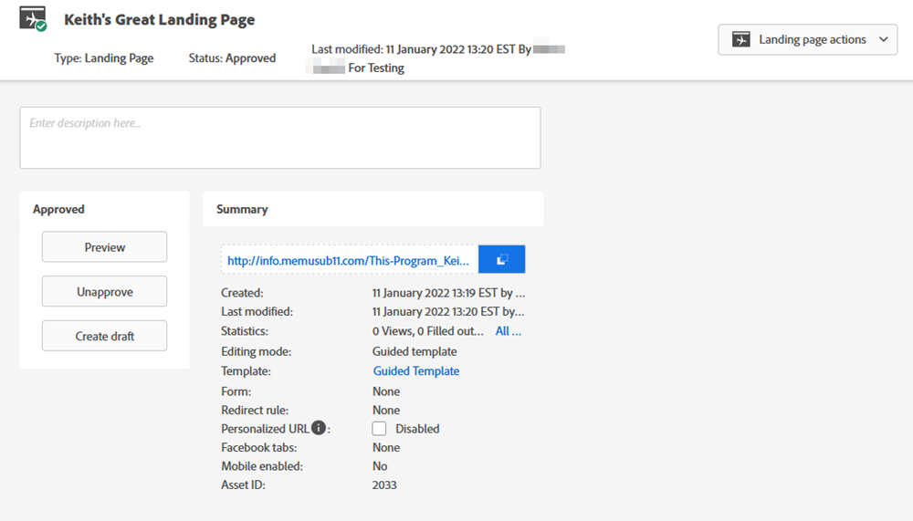

# 切り替えスイッチ {#toggle-switch}

切り替えスイッチを使用すると、Marketoのクラシックインターフェイスと新しい次世代Marketo Engageエクスペリエンスを切り替えることができます。 ランディングページのリスト表示およびフォームの詳細ページで使用できます。

>[!NOTE]
>
>切り替えスイッチを選択すると、UI が変更される前に、既存のすべてのワークフローが自動保存されます。 操作が既に進行中の場合 ( 例：アセットが承認中である ) の場合は、その旨を示すエラーメッセージが表示され、操作が完了した後にもう一度やり直す必要があります。

## ランディングページのリスト表示 {#landing-page-list-view}

次世代のランディングページのリストビューでは、検索フィルターと、大量のランディングページアクションを実行できます。

1. Marketoで、 **デザインスタジオ**.

   

1. 選択 **ランディングページ**.

   

1. ページの右下で、 **新しいエクスペリエンス** 切り替え

   

新しいエクスペリエンスが読み込まれます。

## フォームの詳細ページ {#form-details-page}

1. Marketoで、フォームを検索して選択します。

   

1. ページの右下で、 **新しいエクスペリエンス** 切り替え

   

新しいエクスペリエンスが読み込まれます。

## すべての機能を有効にする {#enable-for-all-features}

現在および今後提供されるすべての機能に対して、Marketoの次世代インターフェイスを有効にするオプションがあります。

1. 現在切り替えスイッチを持つ領域 ( この例では、 [フォームの詳細ページ](#form-details-page))、ページの右下にある歯車アイコンをクリックします。

   

1. 選択 **使用可能なすべての機能を有効にする** をクリックし、 **OK**.

   
