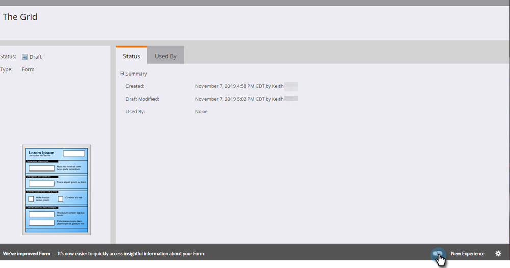
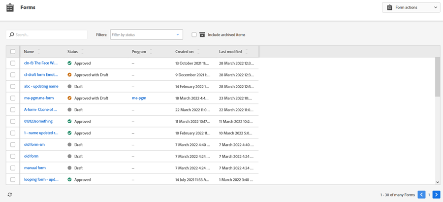

# 切替スイッチ {#toggle-switch}

切り替えスイッチを使用すると、Marketoのクラシックインターフェイスと次世代のMarketo Engageエクスペリエンスを切り替えることができます。 以下に示すすべての領域で使用できます。 2022 年 5 月のリリース以降、次世代エクスペリエンスはデフォルトで有効になります。

>[!NOTE]
>
>切替スイッチを選択すると、UI が変更される前に、既存のすべてのワークフローが自動保存されます。操作が既に進行中の場合（例：アセットが承認中）の場合は、その旨を示すエラーメッセージが表示され、操作が完了した後にもう一度やり直す必要があります。

## 個々のロールの切り替えスイッチの有効化 {#enable-the-toggle-switch-for-individual-roles}

個々の役割またはすべての役割の切り替えスイッチを有効にします。 手順は以下のとおりです。

1. Marketo Engageで、 **管理者**.

   

1. クリック **新しいエクスペリエンス**.

   

1. 切り替えスイッチにアクセスする役割を選択します。

   

## ランディングページのリスト表示 {#landing-page-list-view}

次世代ランディングページのリスト表示では、検索フィルターと、大量のランディングページアクションを実行できます。

1. Marketo で、**Design Studio** を選択します。

   

1. **ランディングページ**&#x200B;を選択します。

   

1. ページの右下で、「**新しいエクスペリエンス**」切替スイッチをクリックします。

   

新しいエクスペリエンスが読み込まれます。

## ランディングページの詳細ページ {#landing-page-details-page}

1. Marketoで、ランディングページを探して選択します。

   

1. ページの右下で、「**新しいエクスペリエンス**」切替スイッチをクリックします。

   

新しいエクスペリエンスが読み込まれます。

## フォームの詳細ページ {#form-details-page}

1. Marketo で、フォームを検索して選択します。

   

1. ページの右下で、「**新しいエクスペリエンス**」切替スイッチをクリックします。

   

新しいエクスペリエンスが読み込まれます。

## フォームリスト表示 {#form-list-view}

1. Marketo で、**Design Studio** を選択します。

   

1. 選択 **Forms**.

   

1. ページの右下で、「**新しいエクスペリエンス**」切替スイッチをクリックします。

   

新しいエクスペリエンスが読み込まれます。

## メールテンプレートの詳細ビュー {#email-template-details-view}

1. Marketo で、**Design Studio** を選択します。

   

1. 目的の E メールテンプレートを選択します。

   

1. ページの右下で、「**新しいエクスペリエンス**」切替スイッチをクリックします。

   

新しいエクスペリエンスが読み込まれます。

## すべての機能で有効化 {#enable-for-all-features}

現在および今後リリースされるすべての機能に対して、Marketoの次世代インターフェイスを手動で有効にすることもできます。

1. 現在切替スイッチを持つ領域（この例では[フォームの詳細ページ](#form-details-page)）で、ページの右下にある歯車アイコンをクリックします。

   

1. 「**使用可能なすべての機能で有効にする**」を選択して、「**OK**」をクリックします。

   
