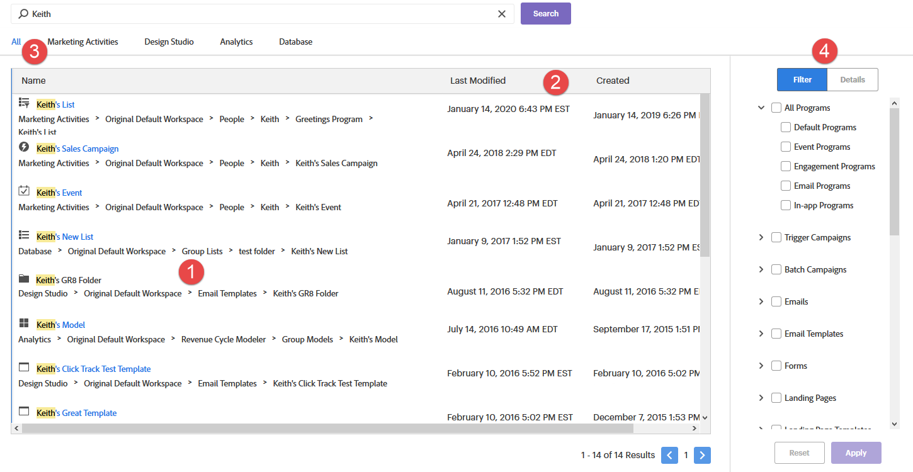

# グローバル検索の使用{#using-the-global-search}

強力なグローバル検索機能により、多くの選択肢が提供されます。 彼らを乗り越えよう。

## オートコンプリートの結果{#autocomplete-results}

オートコンプリートでは、探しているものがすぐに表示される場合があります。

1. グローバルナビゲーションで、「**検索**」をクリックします。

   

1. アセットの識別テキストを入力します。

   

1. オートコンプリート検索結果が表示されます。 パンくずリストの任意の場所をクリックすると、その項目に直接移動できます。

   

1. この例では、探しているリストに直接連れて行くことを選択しています。 リストの名前をクリックします。

   

目的のリストに直接移動します。

## グローバル検索結果{#global-search-results}

オートコンプリートの結果に探しているものが表示されない場合は、フル検索を使用します。

1. グローバルナビゲーションで、「**検索**」をクリックします。

   

1. アセットの識別テキストを入力し、「**検索**」をクリックします。

   

1. グローバル検索結果ページが開きます。

   

<table> 
 <tbody>
  <tr>
   <td>3</td> 
   <td>すべての検索結果の最初（またはのみ）のページで、パンくずリストの任意の場所をクリックすると、その領域に直接移動します</td> 
  </tr>
  <tr>
   <td>2</td> 
   <td>アイテムが作成された日付/時刻/最終変更日</td> 
  </tr>
  <tr>
   <td>3</td> 
   <td>検索する特定のメインマーケティングセクションを選択するか、またはすべてを一度に検索します</td> 
  </tr>
  <tr>
   <td>4</td> 
   <td>検索結果を絞り込むための集中的なフィルターの実装</td> 
  </tr>
 </tbody>
</table>

オプションの手順：フィルタリングを利用するには、オプションを選択し、**適用**&#x200B;をクリックします。

オプションの手順：項目の詳細を表示するには、その行の「空白」をクリックします。

オプションの手順：パンくずリストの最後のアイテムに直接移動するには、パンくずリストの最後のアイテムをクリックするか、または下のアイコンが表示されるまで行の「空白」の上にマウスを移動してクリックします。

