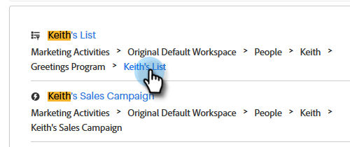
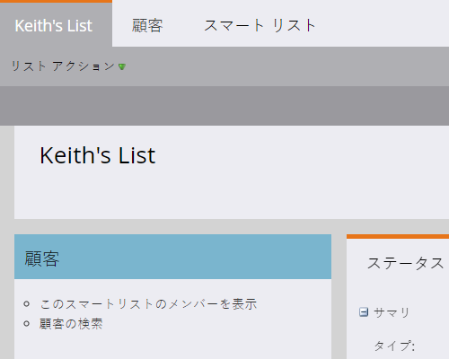

# グローバル検索の使用 {#using-the-global-search}

強力なグローバル検索機能により、表示される結果に制限なく、多くのオプションを利用できます。

## 検索の実行 {#performing-a-search}

1. グローバルナビゲーションで、検索アイコンをクリックします。

   

1. アセットの識別テキストを入力します。

   

1. 検索結果が表示されます。 任意のパンくずリストの任意の場所をクリックして、その項目に直接移動できます。

   

1. この例では、探している E メールに直接移動することを選択しています。 E メールの名前をクリックします。

   

目的の E メールに直接移動します。

## 検索結果ページ {#search-results-page}

<table> 
 <tbody>
  <tr>
   <td>1</td> 
   <td>項目/宛先の名前</td> 
  </tr>
  <tr>
   <td>2</td> 
   <td>各項目/宛先へのパス（パンくずリスト）</td> 
  </tr>
  <tr>
   <td>3</td> 
   <td>品目/宛先が最後に変更された日時</td> 
  </tr>
  <tr>
   <td>4</td> 
   <td>項目/宛先が作成された日時</td> 
  </tr>
  <tr>
   <td>5</td> 
   <td>検索結果を絞り込むためのフォーカスされたフィルターの実装</td> 
  </tr>
 </tbody>
</table>

**オプションの手順**:フィルタリングを利用するには、目的のオプションを選択するだけです。

