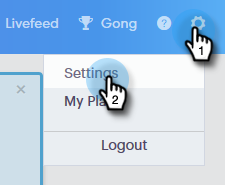

# コンテンツのロックダウン{#content-lockdown}

コンテンツのロックダウンを有効にすることで、管理者以外のユーザーがテンプレートやキャンペーンを編集できないように制限します。 ユーザーは次の操作を実行できません。コンテンツの共有、コピー、編集または削除を行います。 また、テンプレートをアーカイブするオプションもありません。

>[!NOTE]
>
>ユーザー&#x200B;**は、送信時またはキャンペーンの起動時に、電子メールの内容を引き続き編集できます。**

1. Sales Connectで、設定アイコンをクリックし、**設定**&#x200B;を選択します。

   

1. 「管理設定」で、「**一般**」をクリックします。

   

1. 「Content Lockdown」まで下にスクロールします。 どちらかのスライダをオンにすると、チームメンバーがテンプレートやキャンペーンを作成/編集する機能を&#x200B;*無効*&#x200B;にします。

   

