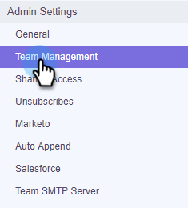
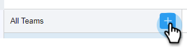
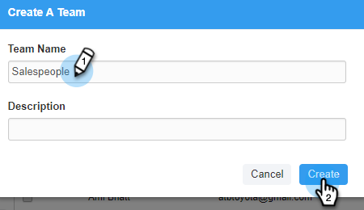
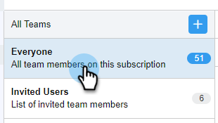
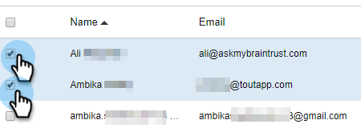
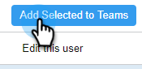
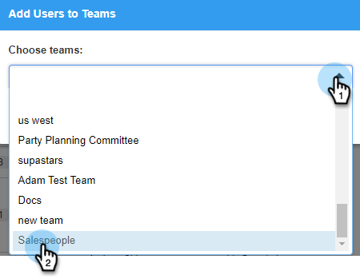
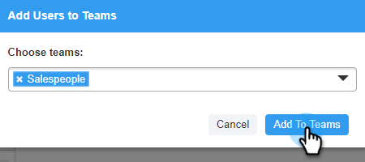

# サブチームの作成 {#create-a-sub-team}

## サブチームの作成 {#create-a-sub-team-1}

1. 歯車アイコンをクリックし、「**[!UICONTROL 設定]**」を選択します。

   

1. 「[!UICONTROL 管理者設定]」で、「**[!UICONTROL チーム管理]**」を選択します。

   

1. 「[!UICONTROL すべてのチーム]」の横にある「**+**」をクリックします。

   

1. チーム名（およびオプションで説明）を入力し、「**[!UICONTROL 作成]**」をクリックします。

   

   >[!NOTE]
   >
   >これで、テンプレート、キャンペーンおよびグループをそのチームと共有できるようになりました。

## サブチームにユーザーを追加 {#add-people-to-your-sub-team}

1. 引き続き「[!UICONTROL チーム管理]」で、「**[!UICONTROL 全員]**」グループを選択します。

   

1. サブチームに追加するユーザを見つけ、そのチェックボックスを選択します。

   

1. 「**[!UICONTROL 選択したユーザーをチームに追加]**」をクリックします。

   

1. ドロップダウンをクリックし、目的のチームを選択します。

   

1. 終了したら「**[!UICONTROL チームに追加]**」をクリックします。

   
