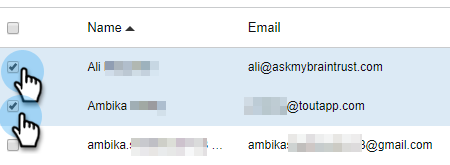
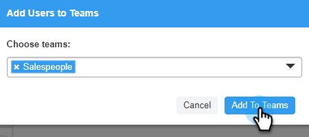

# サブチームの作成 {#create-a-sub-team}

## サブチームの作成 {#create-a-sub-team-1}

1. 歯車アイコンをクリックし、「**[!UICONTROL 設定]**」を選択します。

   

1. [!UICONTROL &#x200B; 管理設定 &#x200B;] で、「**[!UICONTROL チーム管理]**」を選択します。

   

1. [!UICONTROL &#x200B; すべてのチーム &#x200B;] の横の「**+**」をクリックします。

   

1. チーム名（およびオプションで説明）を入力し、「**[!UICONTROL 作成]**」をクリックします。

   

   >[!NOTE]
   >
   >これで、テンプレート、キャンペーンおよびグループをそのチームと共有できるようになりました。

## サブチームにユーザーを追加 {#add-people-to-your-sub-team}

1. [!UICONTROL &#x200B; チーム管理 &#x200B;] のまま、**[!UICONTROL 全員]** グループを選択します。

   

1. サブチームに追加するユーザーを見つけ、そのチェックボックスをオンにします。

   

1. 「**[!UICONTROL 選択したユーザーをチームに追加]**」をクリックします。

   

1. ドロップダウンをクリックし、目的のチームを選択します。

   

1. 終了したら「**[!UICONTROL チームに追加]**」をクリックします。

   
