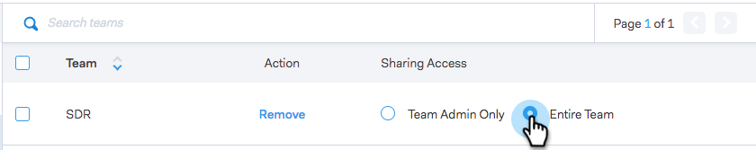

# 設定の共有 {#sharing-settings}

ユーザーが共有可能な項目やカテゴリを制限して、テンプレートを適切に管理しましょう。

MSE または ToutApp のアカウントを最初に作成すると、設定の共有が有効になります。これにより、チームのカテゴリ内のコンテンツを共有できる機能をユーザーに追加しなくても、アカウント管理者がテンプレートカテゴリを作成し、構成できるようになります。

設定の共有が有効になると、管理者のみカテゴリを共有できます。チーム管理者やチーム全員が共有権限を持つには、権限の追加が必要になります。設定の共有を無効にした場合、制限はなく、すべてのユーザーが任意のテンプレートカテゴリで共有できます。

## 設定の共有 {#configure-your-sharing-settings}

1. [Web アプリケーション](https://toutapp.com/login)で、設定ページに移動します。

   

1. 管理設定で、「**アクセス権の共有**」を選択します。

   

1. 「**設定の共有**」が有効になっていることを確認します。つまり、デフォルトでは、管理者のみがテンプレートカテゴリのテンプレートを共有できます。

   

1. 設定するテンプレートカテゴリを選択します。

   

1. 「**アクセスするチームを追加**」をクリックします。

   

1. 追加するチームを選択します。

   

   >[!NOTE]
   >
   >チームが表示されない場合は、チーム管理に移動して、ユーザーのチームを作成する必要があります。

1. 「**アクセスするチームを追加**」をクリックすると保存されます。

   

1. チームが追加されたので、チーム管理者のみがチームの共有を許可するか、そのチームのすべてのユーザーを共有するかを選択できます。この例では、SDR チームのすべてのユーザーに共有アクセス権を付与しました。

   
