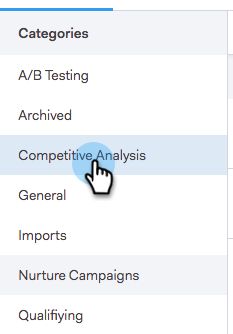

# 設定の共有 {#sharing-settings}

ユーザが共有可能な項目やカテゴリを制限して、テンプレートを適切に管理しましょう。

Sales Connect アカウントを最初に作成すると、[!UICONTROL 設定の共有]が有効になります。 これにより、アカウント管理者は、ユーザがチームのカテゴリ内のコンテンツを共有できるようにする前に、テンプレートカテゴリを作成し、整理する機会を得られます。

[!UICONTROL 設定の共有]が有効になると、チームや全員に共有権限が付与されていない限り、管理者のみがカテゴリを共有できます。 [!UICONTROL 設定の共有]を無効にした場合、制限はなく、すべてのユーザが任意のテンプレートカテゴリに共有できます。

## 設定の共有の設定 {#configure-your-sharing-settings}

1. [Web アプリケーション](https://toutapp.com/login)で、[!UICONTROL 設定]ページに移動します。

   

1. 「[!UICONTROL 管理者設定]」で、「**[!UICONTROL アクセス権の共有]**」を選択します。

   

1. 「**[!UICONTROL 設定の共有]**」が有効になっていることを確認します。 つまり、デフォルトでは、管理者のみがテンプレートカテゴリのテンプレートを共有できます。

   

1. 設定するテンプレートカテゴリを選択します。

   

1. 「**[!UICONTROL アクセスするチームを追加]**」をクリックします。

   

1. 追加するチームを選択します。

   

   >[!NOTE]
   >
   >チームが表示されない場合は、チーム管理に移動して、ユーザのチームを作成する必要があります。

1. 「**[!UICONTROL アクセスするチームを追加]**」をクリックすると保存されます。

   

1. チームが追加されたので、チーム管理者のみがチームの共有を許可するか、そのチームのすべてのユーザを共有するかを選択できます。 この例では、SDR チームのすべてのユーザーに共有アクセス権を付与しました。

   
