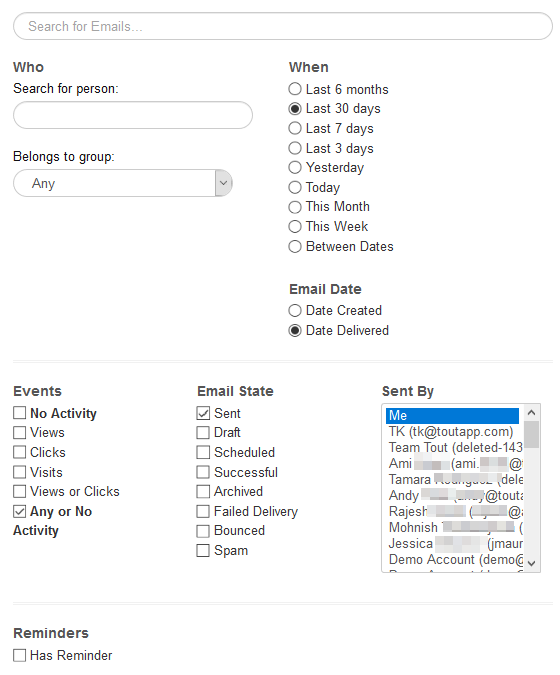

# ユーザーアクセスの詳細{#user-access-details}

管理者および非管理者は何にアクセスできますか？

## 管理者ユーザー権限{#admin-user-permissions}

管理者は、すべてのテンプレート[を&lt;a0/>表示できます。](http://docs.marketo.com/x/OYAXAQ)

管理者は[すべてのキャンペーン](http://docs.marketo.com/x/N4AXAQ)を表示できます。

管理者は、[すべての電子メールアクティビティ](http://docs.marketo.com/x/SYAXAQ)を表示できます。

管理者は、実行中のキャンペーンーのすべてのユーザーを表示できます。

すべての人のレコードは、Everyoneグループでアクセスできます。

管理者は、ユーザーの代わりにキャンペーンを停止できます。

## 非管理者ユーザー権限{#non-admin-user-permissions}

* 解析：

   * ユーザーはチーム分析を表示できます
   * ユーザーは、所属するチームのみを詳細に調べることができます
   * ユーザーは独自の解析を確認できます

* 関係ページ：

   * ユーザーは全員とグループを共有できます
   * ユーザーは、所属するチームとのみグループを共有できます
   * ユーザーが削除されると、その共有連絡先は、そのユーザーを削除したマスター管理者に所有権を転送します

* 販売ビート — 次とライブフィード：

   * ユーザーは「全員」の表示を表示できます
   * ユーザーは、所属するチームでフィルターできます
   * ユーザーは全員と投稿を共有できます
   * ユーザーは、所属するチームとのみ投稿を共有できます

* チーム管理ページ：

   * 表示できません

* テンプレートページ：

   * ユーザーは全員とテンプレートを共有できます
   * ユーザーは、管理者が
   * ユーザーがチームから削除されると、そのユーザーのテンプレートはそのチームと共有されなくなります
   * ユーザーがチームから削除されると、そのテンプレートは、そのユーザーを削除したマスター管理者に所有権を転送します

