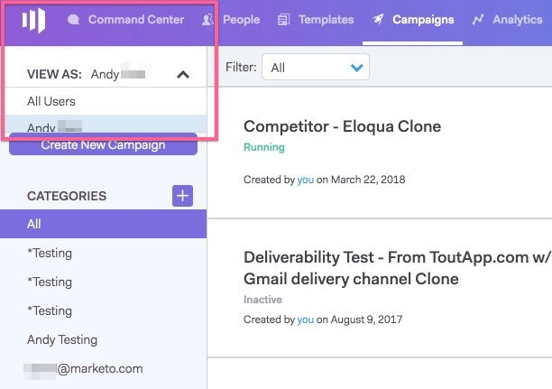

# ユーザーアクセスの詳細 {#user-access-details}

管理者と非管理者は何にアクセスできますか？

## 管理者ユーザーの権限 {#admin-user-permissions}

管理者が実行できる操作 [すべてのテンプレートを表示](/help/marketo/product-docs/marketo-sales-connect/templates/view-template-list-as-another-user.md).

管理者が実行できる操作 [すべてのキャンペーンを表示](/help/marketo/product-docs/marketo-sales-connect/campaigns/view-campaigns-list-as-another-user.md).

管理者は、すべての電子メールアクティビティを表示できます。

管理者は、実行中のキャンペーンのすべての人を表示できます。

すべての担当者レコードは、「全員」グループからアクセスできます。

管理者は、ユーザーの代わりにキャンペーンを停止できます。

## 管理者以外のユーザー権限 {#non-admin-user-permissions}

* アナリティクス:

   * ユーザーはチーム分析を表示できます
   * ユーザーは所属するチームのみを詳細に調べることができます
   * ユーザーは独自の分析を表示できます

* 関係ページ：

   * ユーザーは全員とグループを共有できます
   * ユーザーは、所属するチームとのみグループを共有できます
   * ユーザーが削除されると、そのユーザーの共有連絡先は、そのユーザーを削除したマスター管理者に所有権を転送します

* セールスビート — 次とライブフィード：

   * ユーザーは「全員」ビューを表示できます
   * ユーザーは所属するチームでフィルタリングできます
   * ユーザーは全員と投稿を共有できます
   * ユーザーは、所属するチームとのみ投稿を共有できます

* チーム管理ページ：

   * 表示できません

* テンプレートページ：

   * ユーザーは全員とテンプレートを共有できます
   * ユーザーは、管理者が許可するカテゴリにテンプレートを共有できます
   * ユーザーがチームから削除されると、そのユーザーのテンプレートはそのチームと共有されなくなります
   * ユーザーがチームから削除されると、テンプレートは、ユーザーを削除したマスター管理者に所有権を転送します
