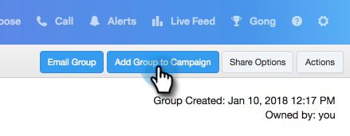

# マーケティングキャンペーンへの追加 {#add-to-marketing-campaign}

>[!PREREQUISITES]
>
>[Sales ユーザにキャンペーンを表示](/help/marketo/product-docs/marketo-sales-connect/marketo/make-a-campaign-visible-to-sales-connect-users.md)

## キャンペーンに個人を追加する {#add-individuals-to-a-campaign}

>[!NOTE]
>
>Sales Connect から Marketo キャンペーンにリードを追加するには、Sales Connect にリードの Marketo リード ID が必要です。

1. 「**リード**」タブをクリックします。

   

1. 追加する連絡先を見つけます。

   

1. チェックをオンにして連絡先を選択します。

   

1. 「**選択したユーザーをキャンペーンに追加**」をクリックします。

   

1. マーケティングキャンペーンに追加するので、「送信者」アドレスの選択はスキップしてください。ただし、取引先責任者をさらに追加することもできます。選択する場合は、「個人」をクリックして入力します。終了したら「**次へ**」をクリックします。

   

1. 「**マーケティングキャンペーン**」をクリックします。

   

1. ワークスペースドロップダウンをクリックし、グループを追加するキャンペーンが含まれているワークスペースを選択します。

   

   >[!NOTE]
   >
   >必要なワークスペースが表示されない場合は、管理者が Marketo チームアクセスページでワークスペースをプロビジョニングしていることを確認してください。

1. 目的のキャンペーンを選択し、「**次へ**」をクリックします。

   

1. 資格のある連絡先が表示されます。「**開始**」をクリックして追加します。

   

## キャンペーンにグループを追加する {#add-a-group-to-a-campaign}

1. 「**リード**」タブをクリックします。

   

1. 「マイグループ」で、キャンペーンに追加するグループを選択します。

   

1. 「**グループをキャンペーンに追加**」をクリックします。

   

1. マーケティングキャンペーンに追加するので、「送信者」アドレスの選択はスキップしてください。ただし、取引先責任者をさらに追加することもできます。選択する場合は、「個人」をクリックして入力します。終了したら「**次へ**」をクリックします。

   

1. 「**マーケティングキャンペーン**」を選択します。

   

   >[!NOTE]
   >
   >Sales Connect から Marketo キャンペーンにリードを追加するには、Sales Connect にリードの Marketo リード ID が必要です。

1. ワークスペースドロップダウンをクリックし、グループを追加するキャンペーンが含まれているワークスペースを選択します。

   

   >[!NOTE]
   >
   >必要なワークスペースが表示されない場合は、管理者が Marketo チームアクセスページでワークスペースをプロビジョニングしていることを確認してください。

1. 目的のキャンペーンを選択し、「**次へ**」をクリックします。

   

1. 資格のある連絡先が表示されます。「**開始**」をクリックして追加します。

   
