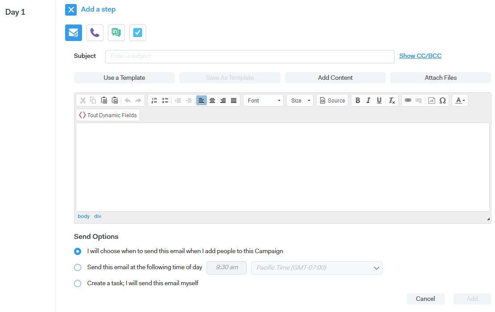
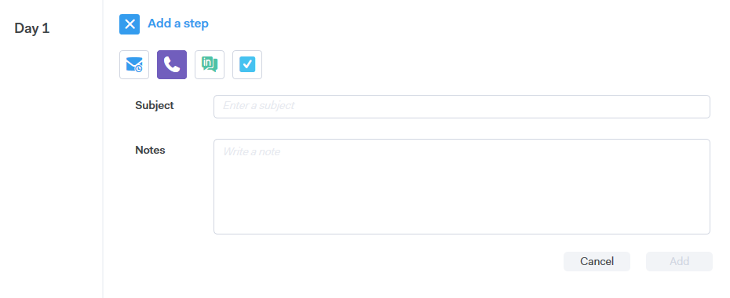
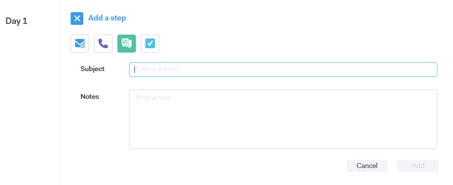
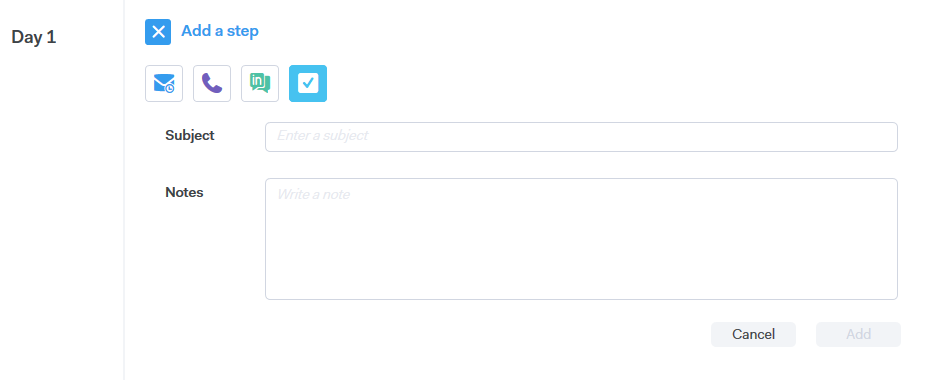

# キャンペーンのステップの種類 {#campaign-step-types}

キャンペーンにステップを追加する場合、4 つの選択肢があります。

## メール {#email}

新しいメールを作成するか、既存のテンプレートを使用します。

| **テンプレートを使用** | 既存のテンプレートの 1 つを選択します |
|---|---|
| **テンプレートとして保存** | 作成したメールを新しいテンプレートとして保存します |
| **コンテンツの追加** | ファイルをアドビのサーバーにアップロードし、メールでトラックできる URL（コンテンツを指す）を受け取ります |
| **ファイルを添付** | コンピューターからメールにファイルを添付します（サイズ制限は 23 MB） |

>[!TIP]
>
>[送信オプション](/help/marketo/product-docs/marketo-sales-connect/campaigns/understanding-send-options.md)の詳細をご覧ください。

## 電話 {#call}

電話で取引先責任者をフォローアップするリマインダーを設定します。 また、通話中にトークトラックとして使用するメモを保存することもできます。

## InMail {#inmail}

複数のチャネルをフォローアップすることは、リードとのつながりを強化する優れた方法です。 InMail タスクを使用して、[!DNL LinkedIn] を介して連絡を取るリマインダーを設定できます。

## カスタムタスク {#custom-task}

上記のオプションを適用できない場合は、カスタムタスクを使用します。 例えば、同僚を招待して、メールでリードをフォローアップすることができます。

