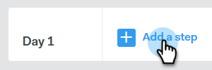

# キャンペーンの作成 {#create-a-campaign}

キャンペーンは、次のような一連の複数チャネルの手順です。電子メール、電話、InMailおよびカスタムタスク。 見込み客や既存の顧客とのコミュニケーションを効率化できます。

キャンペーンを使用すると、次のことができます。

* **整理**:すべてのアウトリーチアクティビティを1か所で合理化し、効率的な実行を実現します。

* **スケール**:取り組みを拡張し、手動の作業を最小限に抑え、必要に応じてパーソナライズできるように、すべての取り組みをスケジュールします。
* **測定**:Salesforceに自動的にログインしながら、すべての電子メールとタスクの成功を1か所で追跡できます。 何が共感を呼び、結果をもたらすのかを知ることで、結果を一貫してテストし、改善することができます。

キャンペーンはどうやって作る？

1. 「 **キャンペーン** 」タブをクリックします。

   

1. カテゴリを選択し、「キャンペーンを **作成** 」ボタンをクリックして、新しいキャンペーンを作成します。

   

   >[!NOTE]
   >
   >「 **カテゴリ」の横にある** +**をクリックして、新しいカテゴリを作成します**。

1. 選択したカテゴリが選択されます。 変更を加えた場合は、ドロップダウンをクリックし、別のドロップダウンを選択します。 終了したら、「 **続行**」をクリックします。

   

1. ステップ **追加をクリックします**。

   

1. 次のいずれかを選択します。電子メール、呼び出し、InMailまたはカスタムタスク。 この例では、「 [電子メール](http://docs.marketo.com/display/DOCS/Campaign+Step+Types#CampaignStepTypes-Email)」を選択します。

   

1. 最初の日とステップを作成すると、「追加日」ボタンがアクティブになり、販売プロセスに必要な日数とステップ数を追加できます。

   

   >[!NOTE]
   >
   >「日数」は、アクション間の日数ではなく、シーケンス内の日数です。 例えば、キャンペーンが過去7日間に進む場合、「3」と入力すると、アクションは7日目の3日目に退出します。**not **3日後に退出します。

1. キャンペーンの[ **設定]タブにアクセスして、週末をスキップするなど、スケジュールと返信のオプションをカスタマイズしてください** 。

   

   今こそ、開始がキャンペーンに人を追加する時です。

