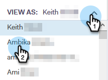

# 別のユーザーとしてキャンペーンリストを表示 {#view-campaigns-list-as-another-user}

管理者は、キャンペーンを任意のユーザーとして表示できます。

>[!NOTE]
>
>**管理者権限が必要**

1. Web アプリケーションで、「**[!UICONTROL キャンペーン]**」をクリックします。

   

1. 「**[!UICONTROL 次のユーザーとして表示]**」ドロップダウンリストをクリックし、目的のユーザーを選択します。

   

1. 現在、選択したユーザーとしてキャンペーンを表示しています。

   

   >[!NOTE]
   >
   >また、「別のユーザとして表示」とフィルターや検索機能を組み合わせて使用し、自分に最も関連性の高いものを表示することもできます。
