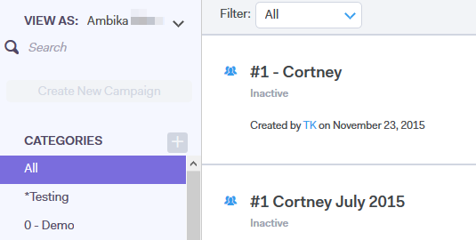

# 別のユーザーとしての表示キャンペーンリスト {#view-campaigns-list-as-another-user}

管理者は、任意のユーザーとしてキャンペーンを表示できます。

>[!NOTE]
>
>**必要な管理者権限**

1. Webアプリケーションで、「 **キャンペーン**」をクリックします。

   

1. 「 **表示名** 」ドロップダウンをクリックし、目的のユーザーを選択します。

   

1. これで、キャンペーンが選択したユーザーとして表示されます。

   

   >[!NOTE]
   >
   >また、フィルターや検索機能を表示Asと共に使用して、最も関連のあるものを表示することもできます。

