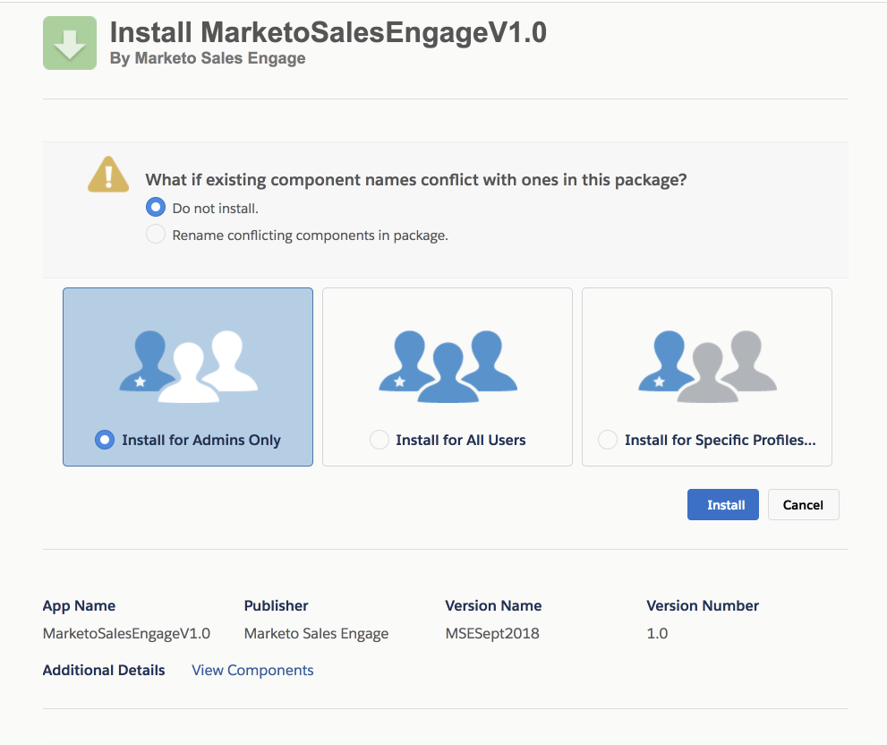

# Professional Edition 顧客向け [!DNL Salesforce] カスタマイズのインストール {#install-salesforce-customization-for-professional-edition-customers}

[!DNL Salesforce] Professional Edition を使用しているお客様が、カスタマイズをインストールするには、次の手順に従う必要があります。

>[!PREREQUISITES]
>
>* [!DNL Sales Connect] 管理者は、[!DNL Salesforce] アカウントと [!DNL Sales Connect] アカウントを接続する必要があります。
>* 使用する [!DNL Salesforce] インスタンスには、13 個のカスタムアクティビティフィールドをインストールするための領域が必要です。

## インストール {#installation}

1. [!DNL Sales Connect] で、右上の歯車アイコンをクリックし、「**[!UICONTROL 設定]**」を選択します。

   

1. 「[!UICONTROL 管理者設定]」で、「**[!UICONTROL Salesforce]**」をクリックします。

   

1. [!DNL Salesforce] アカウントに接続していることを確認します。

   >[!CAUTION]
   >
   >接続している場合、緑色の「[!UICONTROL インストール]」ボタンが表示されます。このボタンをクリック&#x200B;**しない**&#x200B;で、代わりに手順 4 に進みます。

1. 接続している [!DNL Salesforce] アカウントにログインし、[このリンク](https://login.salesforce.com/packaging/installPackage.apexp?p0=04t0b000001oWEZ)をクリックします。
1. [!DNL Sales Connect] インストールページが表示されます。

   

1. カスタマイズをインストールするユーザー（管理者のみ、すべてのユーザー、特定のプロファイルのいずれか）を選択します。
1. 「**[!UICONTROL インストール]**」ボタンをクリックしてカスタマイズをインストールします。
1. インストールが正常に完了したことを確認するには、[!DNL Salesforce] アカウントにログインします。
1. 「**[!UICONTROL 設定]**」をクリックして、検索バーで「インストール済みパッケージ」を検索し、「**[!UICONTROL インストール済みパッケージ]**」をクリックします。

   Marketo Sales Connect のカスタマイズ機能が表示されます。

   [!DNL Salesforce] インスタンスで [!DNL Sales Connect] を設定するには、インストールガイドの 7 ページ目の「SALES ENGAGE SALESFORCE パッケージの設定」セクションから始まる手順に従ってください。

   >[!NOTE]
   >
   >[!DNL Sales Engage] は [!DNL Sales Connect] の以前の名前です。

## ガイド {#guides}

[Salesforce Classic のインストールガイド](https://s3.amazonaws.com/tout-user-store/salesforce/assets/Marketo+Sales+Engage+For+Salesforce_+Installation+and+Success+Guide.pdf)

[Salesforce Lightning のインストールガイド](https://s3.amazonaws.com/tout-user-store/salesforce/assets/SF+Guide+for+Lightning.pdf)
