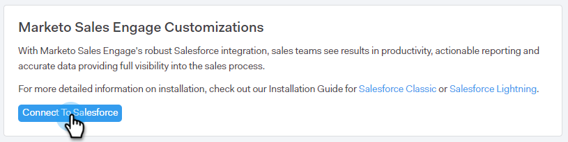
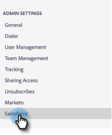

# CRM 用の Sales Connect のカスタマイズ {#sales-connect-customizations-for-crm}

以下のフィールドとボタンは、Salesforce CRM のメタデータ API によって作成されます。フィールドを作成したら、管理者は、CRM でページのレイアウトを設定して公開する必要があります。手順は[ここ](https://docs.marketo.com/display/docs/assets/marketo-sales-engage-for-salesforce-installation-and-success-guide.pdf)にあります。

>[!NOTE]
>
>これは、ToutApp と Sales Connect の両方の顧客に影響を与えます。

## Salesforce でのカスタマイズのインストール方法 {#how-to-install-customizations-in-salesforce}

1. Sales Connect で、歯車アイコンをクリックし、「**設定**」を選択します。

   

1. 管理設定で、**Salesforce** を選択します。

   

1. 「**Marketo Sales Connect のカスタマイズ**」をクリックします。

   

1. 「**Salesforce に接続**」をクリックします。

   

1. Salesforce にログインします。

   

## Salesforce カスタマイズの更新 {#update-salesforce-customization}

Salesforce カスタマイズパッケージのアップデートには、機能強化とバグ修正が含まれます。 更新が利用可能かどうか、または更新を実行するには、次の手順に従います。

>[!NOTE]
>
>**管理者権限が必要です。**

1. 内 [web アプリケーション](https://www.toutapp.com)、歯車アイコンをクリックし、「 **設定**.

   

1. 管理設定で、**Salesforce** をクリックします。

   

1. 更新が利用可能な場合は、セールスコネクトカスタマイズカードが表示されます。 クリック **カスタマイズを更新**.

   

1. クリック **アップグレード**.

   

1. 更新プログラムがインストールされるまで待ちます。 必要なバージョン番号の数に応じて、インストール時間は異なります。

   

完了すると、カードに「セールスコネクトのカスタマイズは最新です」と表示されます。

## カスタムアクティビティフィールド {#custom-activity-fields}

Marketo は、新しいフィールドの作成を検出し、1 回限りのデータのバックフィル、再マッピングおよび&#x200B;**新しい**&#x200B;フィールドへの値の継続的な同期を実行します。古いフィールドは更新されません。

| **フィールド名** | **説明** |
|---|---|
| MSE 電話ローカルプレゼンス ID | ユーザーは、MSE 電話から電話をかける際に、「ローカルプレゼンス」をオプションとして選択できます。着信電話は、受信者のローカル番号を表示します。 |
| MSE 電話録音 URL | 通話は録音され、録音のリンクはここに記録されます。 |
| MSE キャンペーン | 連絡先／リードがメンバーの MSE キャンペーンの名前を記録します。 |
| MSE キャンペーン URL | MSE で作成されたキャンペーンの URL を記録します。これをクリックすると、MSE web アプリでキャンペーンが開きます。 |
| MSE キャンペーンの現在のステップ | 連絡先／リードがキャンペーンの一部である場合、このフィールドには、リード／連絡先が現在参加しているステップの名前が記録されます。 |
| MSE メール添付ファイルの閲覧 | ファイルが添付されたメールが送信され、受信者が添付ファイルを閲覧した場合に、データを記録します。 |
| MSE メールのクリック | 受信者がメール内のリンクをクリックしたときにチェックマークを記録します。 |
| MSE メールの返信 | 受信者がメールに返信したときにチェックマークを記録します。 |
| MSE メールのステータス | メールが送信済み／処理中／バウンスされたかどうかを表示します（バウンスメールのトラッキングは、使用する配信チャネルに依存します）。 |
| MSE メールテンプレート | リード／連絡先に送信されたメールで使用された MSE テンプレートの名前を記録します。 |
| MSE メールテンプレート URL | MSE で作成されたテンプレートの URL を記録します。これをクリックすると、MSE web アプリでテンプレートが開きます。 |
| MSE メール URL | この URL をクリックすると、MSE でコマンドセンターが開き、「リード詳細表示の履歴」タブが前面表示され、送信されたメールを確認できます。 |
| MSE メールの表示 | 受信者がメールを表示したときにチェックマークを記録します。 |

## ログフィールドのロールアップ {#roll-up-logging-fields}

<table> 
 <colgroup> 
  <col> 
  <col> 
 </colgroup> 
 <tbody> 
  <tr> 
   <td><strong>フィールド名</strong></td> 
   <td><strong>説明</strong></td> 
  </tr> 
  <tr> 
   <td>MSE - 最終マーケティングエンゲージメント</td> 
   <td>マーケティングから最後に入ってきたエンゲージメント。 </td> 
  </tr> 
  <tr> 
   <td>MSE - 最終マーケティングエンゲージメント日</td> 
   <td>マーケティングからのエンゲージメントのタイムスタンプ。</td> 
  </tr> 
  <tr> 
   <td>MSE - 最終マーケティングエンゲージメントの説明</td> 
   <td>エンゲージメントの説明。</td> 
  </tr> 
  <tr> 
   <td>MSE - 最終マーケティングエンゲージメントソース</td> 
   <td>マーケティングエンゲージメントのソース。</td> 
  </tr> 
  <tr> 
   <td colspan="1">MSE - 最終マーケティングエンゲージメントのタイプ</td> 
   <td colspan="1">エンゲージメントのタイプ。</td> 
  </tr> 
  <tr> 
   <td colspan="1">MSE - セールスによる最終アクティビティ </td> 
   <td colspan="1">セールスチームが最後に実行した外部アクティビティ。</td> 
  </tr> 
  <tr> 
   <td colspan="1">MSE - 最終返信</td> 
   <td colspan="1">セールスメールに最後に返信したメール。</td> 
  </tr> 
  <tr> 
   <td colspan="1">MSE - 現在のセールスキャンペーン</td> 
   <td colspan="1">リード／連絡先がメンバーの MSE キャンペーンの名前を記録します。</td> 
  </tr> 
  <tr> 
   <td colspan="1">MSE - 最終セールスエンゲージメント</td> 
   <td colspan="1">セールスから最後に入ってきたエンゲージメント。 </td> 
  </tr> 
  <tr> 
   <td colspan="1">MSE - オプトアウト</td> 
   <td colspan="1">オプトアウトフィールド。</td> 
  </tr> 
 </tbody> 
</table>

## ボタン {#buttons}

| **ボタン名** | **説明** |
|---|---|
| MSE メールを送信 | Salesforce からセールスメールを送信します。 |
| MSE キャンペーンに追加 | Salesforce から MSE キャンペーンに追加します。 |
| MSE にプッシュ | Salesforce から MSE に連絡先をプッシュします。 |
| MSE で電話 | Salesforce からセールス電話をかけます。 |

## 一括アクションボタン {#bulk-action-buttons}

| **ボタン名** | **説明** |
|---|---|
| MSE キャンペーンに追加 | Salesforce から MSE キャンペーンに追加します。 |
| MSE にプッシュ | Salesforce から MSE に連絡先をプッシュします。 |

## ユーザーガイド {#user-guides}

[Salesforce の MSE カスタムレポート](https://docs.marketo.com/display/docs/assets/mse-custom-reports-in-sf.docx)

[Salesforce 用の MSE](https://docs.marketo.com/display/docs/assets/mse-for-sf-classic.pdf)

[Salesforce Lightning 用の MSE](https://s3.amazonaws.com/tout-user-store/salesforce/assets/SF+Guide+for+Lightning.pdf)
