# Salesforce Classic からの Marketo Sales Connect のアンインストール {#uninstall-marketo-sales-connect-from-salesforce-classic}

以下に、Sales Insight Actions の使用を開始した後で Salesforce アカウントから Marketo Sales Connect パッケージをアンインストールする方法を示します。

## ページレイアウトからの [!DNL Sales Connect] フィールドの削除 {#remove-sales-connect-fields-from-page-layout}

1. [!DNL Salesforce] Classic で、**[!UICONTROL 設定]** をクリックします。

   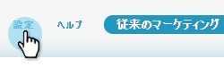

1. 左側のナビゲーションの [!UICONTROL &#x200B; ビルド &#x200B;] で、（クリックせずに） [!UICONTROL &#x200B; カスタマイズ &#x200B;] を展開し、次に [!UICONTROL &#x200B; リード &#x200B;] を展開します。 次に、「**[!UICONTROL ページレイアウト]**」を選択します。

   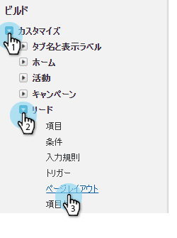

1. リードレイアウトの横にある「**[!UICONTROL 編集]**」をクリックします。

   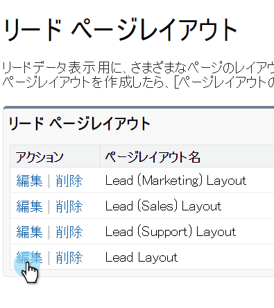

1. コンソールで、「**[!UICONTROL フィールド]**」を選択します。クイック検索で「MSC」を検索します。グレー表示のフィールドはすべて、ページレイアウトに追加されています。削除する必要があります。

   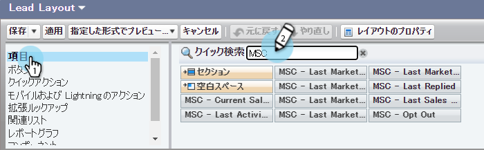

   >[!NOTE]
   >
   >グレー表示になっているフィールドがない場合は、まだページレイアウトに追加されていないことを意味します。このセクションはスキップできます。

1. [!DNL Sales Connect] のカスタムフィールドがあるセクションまでスクロールします。

   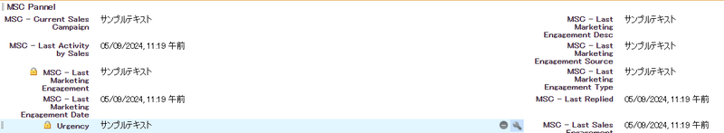

1. このセクションに追加できる MSC フィールドは 10 種類あります。追加したすべてのフィールドを削除するか、単にセクション全体を削除します。

1. 終了したら「**[!UICONTROL 保存]**」をクリックします。

   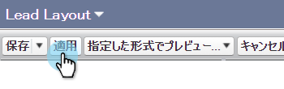

## ページレイアウトからの [!DNL Sales Connect] ボタンの削除 {#remove-sales-connect-buttons-from-page-layouts}

1. コンソールで（上記の手順 4）、「**[!UICONTROL ボタン]**」を選択します。「MSC」を検索します。グレー表示のボタンがすべて、「カスタムボタン」セクションに追加されました。削除する必要があります。

   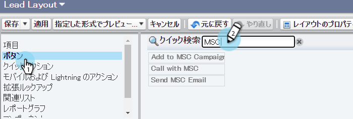

   >[!NOTE]
   >
   >グレー表示になっているボタンがない場合は、まだ追加されていないことを意味します。このセクションはスキップできます。

1. MSC ボタンを「[!UICONTROL &#x200B; カスタム・ボタン &#x200B;] セクションからコンソールにドラッグ・アンド・ドロップします。

   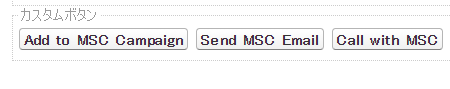

1. 終了したら「**[!UICONTROL 保存]**」をクリックします。

   

## [!DNL Sales Connect] アクティビティ履歴 [!UICONTROL &#x200B; セクションから &#x200B;] フィールドを削除 {#remove-sales-connect-fields-from-activity-history-section}

1. ページの下部までスクロールして「[!UICONTROL &#x200B; アクティビティ履歴 &#x200B;]」関連のリストセクションに移動し、レンチ アイコンをクリックします。

   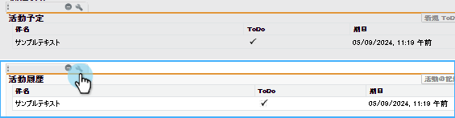

1. 「[!DNL Sales Connect] 選択したフィールド [!UICONTROL 」領域から &#x200B;] のフィールドを選択し、「[!UICONTROL &#x200B; 削除 &#x200B;]」矢印をクリックします。 終了したら、「**[!UICONTROL OK]**」をクリックします。

   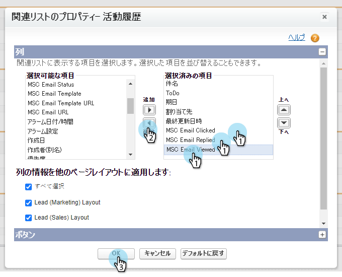

   >[!NOTE]
   >
   >MSE _is_ [!DNL Sales Connect] の略語。 これは「Marketo Sales Engage」という名前です

1. リードページの操作が完了したら、「**保存**」をクリックします。

## リードリスト表示から [!DNL Sales Connect] 一括アクションボタンを削除 {#remove-sales-connect-bulk-action-buttons-from-lead-list-view}

1. 左側のナビゲーションの [!UICONTROL &#x200B; ビルド &#x200B;] で、（クリックせずに） [!UICONTROL &#x200B; カスタマイズ &#x200B;] を展開し、次に [!UICONTROL &#x200B; リード &#x200B;] を展開します。 次に、「**[!UICONTROL 検索レイアウト]**」を選択します。

   

1. リードリスト表示の横の「**[!UICONTROL 編集]**」をクリックします。

   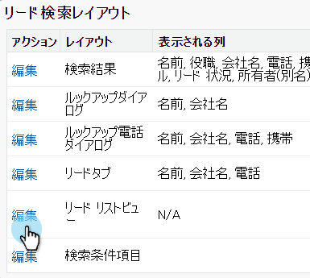

1. **[!UICONTROL MSC Campaign （Classic）に追加]**、**[!UICONTROL MSC （Classic）とメール]**、**[!UICONTROL MSC （Classic）にプッシュ]** を選択し、[!UICONTROL &#x200B; 削除 &#x200B;] 矢印をクリックします。 「**[!UICONTROL 保存]**」をクリックします。

   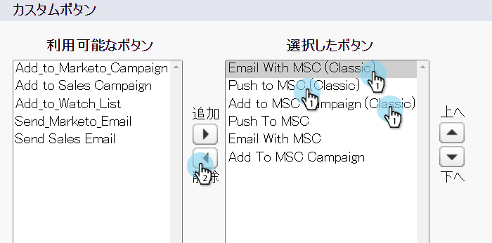

リードリスト表示にボタンが表示されなくなりました。

## 取引先責任者の MSC 設定を削除 {#remove-msc-configuration-for-contacts}

1. [!DNL Salesforce] で、**[!UICONTROL 設定]** をクリックします。

1. 左側のナビゲーションの [!UICONTROL &#x200B; ビルド &#x200B;] で、「[!UICONTROL &#x200B; カスタマイズ &#x200B;]」を展開し、次に「[!UICONTROL &#x200B; 連絡先 &#x200B;]」を展開します（クリックしないでください）。 次に、「**[!UICONTROL ページレイアウト]**」を選択します。

1. 取引先責任者レイアウトの横にある「**[!UICONTROL 編集]**」をクリックします。

1. 3 つのセクションすべてから手順を繰り返します。

## 商談の MSC 設定を削除 {#remove-msc-configuration-for-opportunity}

1. [!DNL Salesforce] で、**[!UICONTROL 設定]** をクリックします。

1. 左側のナビゲーションの [!UICONTROL &#x200B; ビルド &#x200B;] で、「[!UICONTROL &#x200B; カスタマイズ &#x200B;]」を展開し、次に「[!UICONTROL &#x200B; 商談 &#x200B;]」を展開します（クリックしないでください）。 次に、「**[!UICONTROL ページレイアウト]**」を選択します。

1. 商談レイアウトの横にある「**[!UICONTROL 編集]**」をクリックします。

1. 3 つのセクションすべてから手順を繰り返します。

商談表示には、「MSE メールを送信」ボタンが 1 つと以下のフィールドがあります。

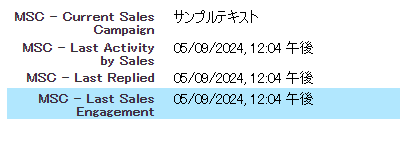

## アカウントの MSC 設定を削除 {#remove-msc-configuration-for-account}

1. [!DNL Salesforce] で、**[!UICONTROL 設定]** をクリックします。

1. 左側のナビゲーションの [!UICONTROL &#x200B; ビルド &#x200B;] で、「[!UICONTROL &#x200B; カスタマイズ &#x200B;]」を展開し、次に「[!UICONTROL &#x200B; アカウント &#x200B;]」を展開します（ただし、クリックしないでください）。 次に、「**[!UICONTROL ページレイアウト]**」を選択します。

1. アカウントレイアウトの横にある「**[!UICONTROL 編集]**」をクリックします。

1. 3 つのセクションすべてから手順を繰り返します。

アカウント表示には、「MSE メールを送信」ボタンが 1 つと以下のフィールドがあります。

## Marketo Sales 送信トレイを削除 {#remove-marketo-sales-outbox}

1. [!DNL Salesforce] で、画面上部の「**+**」タブをクリックします。

1. 「**[!UICONTROL タブをカスタマイズ]**」をクリックします。

1. 右側の「Marketo Sales 送信トレイ」オプションを選択します。[!UICONTROL &#x200B; 削除 &#x200B;] 矢印をクリックしてから、「**[!UICONTROL 保存]** をクリックします。

## パッケージ [!DNL Sales Connect] 削除 {#delete-sales-connect-package}

Salesforce アカウントからすべてのオブジェクトを削除したら、以下の手順に従います。

1. [!DNL Salesforce] で、**[!UICONTROL 設定]** をクリックします。

1. 「クイック検索」ボックスに、「Apex Classes」と入力します。

1. リストのすべての「MarketoSalesConnectionCustomization」または「MarketoSalesEngageCustomization」エントリの横にある「**削除**」をクリックします。

準備完了です。

以下に、Salesforce インスタンスから削除する必要のあるすべてのオブジェクトのリストを示します。

## [!DNL Sales Connect] カスタマイズの詳細 {#sales-connect-customization-details}

<table>
 <tr>
  <th>カスタムアクティビティフィールド</th>
  <th>説明</th>
  <th>タイプ</th>
  <th>データタイプ</th>
 </tr>
 <tr>
  <td>[!UICONTROL MSC 呼び出しのローカル プレゼンス ID]</td>
  <td>ユーザーは、MSC 電話から電話をかける際に、「ローカルプレゼンス」をオプションとして選択できます。着信電話は、受信者のローカル番号を表示します</td>
  <td>アクティビティ</td>
  <td>テキスト</td>
 </tr>
 <tr>
  <td>[!UICONTROL MSC 呼び出し記録 URL]</td>
  <td>通話は録音され、録音のリンクはここに記録されます </td>
  <td>アクティビティ</td>
  <td>テキスト</td>
 </tr>
 <tr>
  <td>[!UICONTROL MSC キャンペーン &#x200B;]</td>
  <td>取引先責任者／リードに適用されている MSC キャンペーンの名前を記録します</td>
  <td>アクティビティ</td>
  <td>テキスト</td>
 </tr>
 <tr>
  <td>[!UICONTROL MSC キャンペーン URL]</td>
  <td>MSC で作成されたキャンペーンの URL を記録します。これをクリックすると、MSC web アプリでキャンペーンが開きます</td>
  <td>アクティビティ</td>
  <td>テキスト</td>
 </tr>
 <tr>
  <td>[!UICONTROL MSC キャンペーンの現在の手順 &#x200B;]</td>
  <td>取引先責任者／リードに適用されているキャンペーンがある場合、このフィールドには、リード／取引先責任者が現在適用されているステップの名前が記録されます</td>
  <td>アクティビティ</td>
  <td>チェックボックス</td>
 </tr>
 <tr>
  <td>[!UICONTROL MSC 電子メール添付ファイルが表示されました &#x200B;]</td>
  <td>ファイルが添付されたメールが送信され、受信者が閲覧した場合に、データを記録します</td>
  <td>アクティビティ</td>
  <td>チェックボックス</td>
 </tr>
 <tr>
  <td>[!UICONTROL MSC Email Clicked]</td>
  <td>受信者がメール内のリンクをクリックしたときにチェックマークを記録します</td>
  <td>アクティビティ</td>
  <td>チェックボックス</td>
 </tr>
 <tr>
  <td>[!UICONTROL MSC E メール返信 &#x200B;]</td>
  <td>受信者がメールに返信したときにチェックマークを記録します</td>
  <td>アクティビティ</td>
  <td>テキスト</td>
 </tr>
 <tr>
  <td>[!UICONTROL MSC 電子メールの状態 &#x200B;]</td>
  <td>メールが送信済み／処理中／バウンスされたかどうかを表示します（バウンスメールのトラッキングは、使用する配信チャネルに依存します）</td>
  <td>アクティビティ</td>
  <td>テキスト</td>
 </tr>
 <tr>
  <td>[!UICONTROL MSC メール テンプレート &#x200B;]</td>
  <td>リード／取引先責任者に送信されたメールで使用された MSC テンプレートの名前を記録します</td>
  <td>アクティビティ</td>
  <td>テキスト</td>
 </tr>
 <tr>
  <td>[!UICONTROL MSC メール テンプレート URL]</td>
  <td>MSC で作成されたテンプレートの URL を記録します。これをクリックすると、MSC web アプリでテンプレートが開きます</td>
  <td>アクティビティ</td>
  <td>テキスト</td>
 </tr>
 <tr>
  <td>[!UICONTROL MSC メール URL]</td>
  <td>この URL をクリックすると、MSC でコマンドセンターが開き、「リード詳細表示の履歴」タブが前面表示され、送信されたメールを確認できます</td>
  <td>アクティビティ</td>
  <td>テキスト</td>
 </tr>
 <tr>
  <td>[!UICONTROL MSC Email Viewed]</td>
  <td>受信者がメールを表示したときにチェックマークを記録します</td>
  <td>アクティビティ</td>
  <td>チェックボックス</td>
 </tr>
</table>

<table>
 <tr>
  <th>MSC ロールアップログフィールド</th>
  <th>説明</th>
  <th>タイプ</th>
  <th>データタイプ</th>
 </tr>
 <tr>
  <td>MSC - 最終マーケティングエンゲージメント</td>
  <td>マーケティングから最後に入ってきたエンゲージメント</td>
  <td>
  
アカウント 
  
取引先責任者 
  
リード 
  
商談</td>
  <td>日時</td>
 </tr>
 <tr>
  <td>MSC - 最終マーケティングエンゲージメント日</td>
  <td>マーケティングからのエンゲージメントのタイムスタンプ</td>
  <td>
  
アカウント 
  
取引先責任者 
  
リード 
  
商談</td>
  <td>日時</td>
 </tr>
 <tr>
  <td>MSC - 最終マーケティングエンゲージメントの説明</td>
  <td>エンゲージメントの説明</td>
  <td>
  
アカウント 
  
取引先責任者 
  
リード 
  
商談</td>
  <td>テキスト</td>
 </tr>
 <tr>
  <td>MSC - 最終マーケティングエンゲージメントソース</td>
  <td>マーケティングエンゲージメントのソース</td>
  <td>
  
アカウント 
  
取引先責任者 
  
リード 
  
商談</td>
  <td>テキスト</td>
 </tr>
 <tr>
  <td>MSC - 最終マーケティングエンゲージメントのタイプ</td>
  <td>エンゲージメントのタイプ（例：web アクティビティ）</td>
  <td>
  
アカウント 
  
取引先責任者 
  
リード 
  
商談</td>
  <td>テキスト</td>
 </tr>
 <tr>
  <td>MSC - セールスによる最終アクティビティ</td>
  <td>セールスチームが最後に実行した外部アクティビティ</td>
  <td>
  
アカウント 
  
取引先責任者 
  
リード 
  
商談</td>
  <td>日時</td>
 </tr>
 <tr>
  <td>MSC - 最終返信</td>
  <td>セールスメールに最後に返信したメール</td>
  <td>
  
アカウント 
  
取引先責任者 
  
リード 
  
商談</td>
  <td>日時</td>
 </tr>
 <tr>
  <td>MSC - 現在のセールスキャンペーン</td>
  <td>取引先責任者／リードに適用されている MSC キャンペーンの名前を記録します</td>
  <td>
  
アカウント 
  
取引先責任者 
  
リード 
  
商談</td>
  <td>テキスト</td>
 </tr>
 <tr>
  <td>MSC - 最終セールスエンゲージメント</td>
  <td>セールスから最後に入ってきたエンゲージメント</td>
  <td>
  
アカウント 
  
取引先責任者 
  
リード 
  
商談</td>
  <td>日時</td>
 </tr>
 <tr>
  <td>MSC - オプトアウト</td>
  <td>オプトアウトフィールド</td>
  <td>
  
アカウント 
  
取引先責任者 
  
リード 
  
商談</td>
  <td>チェックボックス</td>
 </tr>
</table>

<table>
 <tr>
  <th>MSC ボタン</th>
  <th>説明</th>
  <th>タイプ</th>
 </tr>
 <tr>
  <td>[!UICONTROL MSC メールの送信 &#x200B;]</td>
  <td>からの販売 E メールの送信 [!DNL Salesforce]</td>
  <td>
  
アカウント 
  
取引先責任者 
  
リード 
  
商談</td>
 </tr>
 <tr>
  <td>[!UICONTROL MSC キャンペーンに追加 &#x200B;]</td>
  <td>から MSC キャンペーンに追加 [!DNL Salesforce]</td>
  <td>
  
取引先責任者
  
リード</td>
 </tr>
 <tr>
  <td>[!UICONTROL MSC へのプッシュ &#x200B;]</td>
  <td>[!DNL Salesforce] から MSC への連絡先のプッシュ</td>
  <td>
  
取引先責任者
  
リード</td>
 </tr>
 <tr>
  <td>[!UICONTROL MSC を使用した 呼び出し &#x200B;]</td>
  <td>から営業の電話をかける [!DNL Salesforce]</td>
  <td>
  
取引先責任者
  
リード</td>
 </tr>
</table>

<table>
 <tr>
  <th>MSC 一括アクションボタン</th>
  <th>説明</th>
  <th>タイプ</th>
 </tr>
 <tr>
  <td>[!UICONTROL MSC キャンペーンに追加（クラシック） &#x200B;]</td>
  <td>から MSC キャンペーンに追加 [!DNL Salesforce]</td>
  <td>
  
取引先責任者
  
リード</td>
 </tr>
 <tr>
  <td>[!UICONTROL による MSC へのプッシュ（クラシック） &#x200B;]</td>
  <td>[!DNL Salesforce] から MSC への連絡先のプッシュ</td>
  <td>
  
取引先責任者
  
リード</td>
 </tr>
 <tr>
  <td>[ !MSC との電子メールを制御（クラシック） ]</td>
  <td>からの MSC を含む電子メール [!DNL Salesforce]</td>
  <td>
  
取引先責任者
  
リード</td>
 </tr>
</table>
