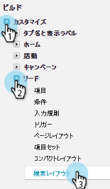

# Salesforce Classic からの Marketo Sales Connect のアンインストール {#uninstall-marketo-sales-connect-from-salesforce-classic}

以下に、Sales Insight Actions の使用を開始した後で Salesforce アカウントから Marketo Sales Connect パッケージをアンインストールする方法を示します。

## ページレイアウトから [!DNL Sales Connect] フィールドを削除 {#remove-sales-connect-fields-from-page-layout}

1. [!DNL Salesforce] Classic で、「**[!UICONTROL 設定]**」をクリックします。

   

1. 左側のナビゲーションの「[!UICONTROL ビルド]」で、「[!UICONTROL カスタマイズ]」、「[!UICONTROL リード]」の順に展開します（ただし、クリックしないでください）。次に、「**[!UICONTROL ページレイアウト]**」を選択します。

   

1. リードレイアウトの横にある「**[!UICONTROL 編集]**」をクリックします。

   

1. コンソールで、「**[!UICONTROL フィールド]**」を選択します。クイック検索で「MSC」を検索します。グレー表示のフィールドはすべて、ページレイアウトに追加されています。削除する必要があります。

   

   >[!NOTE]
   >
   >グレー表示になっているフィールドがない場合は、まだページレイアウトに追加されていないことを意味します。このセクションはスキップできます。

1. [!DNL Sales Connect] のカスタムフィールドが設定されたセクションにスクロールします。

   

1. このセクションに追加できる MSC フィールドは 10 種類あります。追加したすべてのフィールドを削除するか、単にセクション全体を削除します。

1. 終了したら「**[!UICONTROL 保存]**」をクリックします。

   

## ページレイアウトから [!DNL Sales Connect] のボタンを削除 {#remove-sales-connect-buttons-from-page-layouts}

1. コンソールで（上記の手順 4）、「**[!UICONTROL ボタン]**」を選択します。「MSC」を検索します。グレー表示のボタンがすべて、「カスタムボタン」セクションに追加されました。削除する必要があります。

   

   >[!NOTE]
   >
   >グレー表示になっているボタンがない場合は、まだ追加されていないことを意味します。このセクションはスキップできます。

1. 「[!UICONTROL カスタムボタン]」セクションからコンソールに MSC ボタンをドラッグ＆ドロップします。

   

1. 終了したら「**[!UICONTROL クイック保存]**」をクリックします。

   

## 「[!UICONTROL アクティビティ履歴]」セクションから [!DNL Sales Connect] のフィールドを削除 {#remove-sales-connect-fields-from-activity-history-section}

1. ページの下部までスクロールして、「[!UICONTROL アクティビティ履歴]」関連リストセクションに移動し、レンチアイコンをクリックします。

   

1. 「[!UICONTROL 選択したフィールド]」領域で「[!DNL Sales Connect] のフィールド」を選択し、「[!UICONTROL 削除]」矢印をクリックします。終了したら、「**[!UICONTROL OK]**」をクリックします。

   

   >[!NOTE]
   >
   >MSE _は_ [!DNL Sales Connect] の略語です。これは「Marketo Sales Engage」という名前です。

1. リードページの操作が完了したら、「**保存**」をクリックします。

## リードリスト表示から [!DNL Sales Connect] の一括アクションボタンを削除 {#remove-sales-connect-bulk-action-buttons-from-lead-list-view}

1. 左側のナビゲーションの「[!UICONTROL ビルド]」で、「[!UICONTROL カスタマイズ]」、「[!UICONTROL リード]」の順に展開します（ただし、クリックしないでください）。次に、「**[!UICONTROL 検索レイアウト]**」を選択します。

   

1. リードリスト表示の横の「**[!UICONTROL 編集]**」をクリックします。

   

1. 「**[!UICONTROL MSC キャンペーン（Classic）に追加]**」、「**[!UICONTROL MSC（Classic）でメール送信]**」、「**[!UICONTROL MSC（Classic）にプッシュ]**」を選択し、[!UICONTROL 削除]の矢印をクリックします。「**[!UICONTROL 保存]**」をクリックします。

   

リードリスト表示にボタンが表示されなくなりました。

## 取引先責任者の MSC 設定を削除 {#remove-msc-configuration-for-contacts}

1. [!DNL Salesforce] で、「**[!UICONTROL 設定]**」をクリックします。

1. 左側のナビゲーションの「[!UICONTROL ビルド]」で、「[!UICONTROL カスタマイズ]」、「[!UICONTROL 取引先責任者]」の順に展開します（ただし、クリックしないでください）。次に、「**[!UICONTROL ページレイアウト]**」を選択します。

1. 取引先責任者レイアウトの横にある「**[!UICONTROL 編集]**」をクリックします。

1. 3 つのセクションすべてから手順を繰り返します。

## 商談の MSC 設定を削除 {#remove-msc-configuration-for-opportunity}

1. [!DNL Salesforce] で、「**[!UICONTROL 設定]**」をクリックします。

1. 左側のナビゲーションの「[!UICONTROL ビルド]」で、「[!UICONTROL カスタマイズ]」、「[!UICONTROL 商談]」の順に展開します（ただし、クリックしないでください）。次に、「**[!UICONTROL ページレイアウト]**」を選択します。

1. 商談レイアウトの横にある「**[!UICONTROL 編集]**」をクリックします。

1. 3 つのセクションすべてから手順を繰り返します。

商談表示には、「MSE メールを送信」ボタンが 1 つと以下のフィールドがあります。

## アカウントの MSC 設定を削除 {#remove-msc-configuration-for-account}

1. [!DNL Salesforce] で、「**[!UICONTROL 設定]**」をクリックします。

1. 左側のナビゲーションの「[!UICONTROL ビルド]」で、「[!UICONTROL カスタマイズ]」、「[!UICONTROL アカウント]」の順に展開します（ただし、クリックしないでください）。次に、「**[!UICONTROL ページレイアウト]**」を選択します。

1. アカウントレイアウトの横にある「**[!UICONTROL 編集]**」をクリックします。

1. 3 つのセクションすべてから手順を繰り返します。

アカウント表示には、「MSE メールを送信」ボタンが 1 つと以下のフィールドがあります。

## Marketo Sales アウトボックスを削除 {#remove-marketo-sales-outbox}

1. [!DNL Salesforce] で、画面上部の「**+**」タブをクリックします。

1. 「**[!UICONTROL タブをカスタマイズ]**」をクリックします。

1. 右側の「Marketo Sales 送信トレイ」オプションを選択します。[!UICONTROL 削除]矢印をクリックし、「**[!UICONTROL 保存]**」をクリックします。

## [!DNL Sales Connect] パッケージを削除 {#delete-sales-connect-package}

Salesforce アカウントからすべてのオブジェクトを削除したら、以下の手順に従います。

1. [!DNL Salesforce] で、「**[!UICONTROL 設定]**」をクリックします。

1. 「クイック検索」ボックスに、「Apex Classes」と入力します。

1. リストのすべての「MarketoSalesConnectionCustomization」または「MarketoSalesEngageCustomization」エントリの横にある「**削除**」をクリックします。

準備完了です。

以下に、Salesforce インスタンスから削除する必要のあるすべてのオブジェクトのリストを示します。

## [!DNL Sales Connect] カスタマイズの詳細 {#sales-connect-customization-details}

<table>
 <tr>
  <th>カスタムアクティビティフィールド</th>
  <th>説明</th>
  <th>タイプ</th>
  <th>データタイプ</th>
 </tr>
 <tr>
  <td>[!UICONTROL MSC 電話ローカルプレゼンス ID]</td>
  <td>ユーザは、MSC 電話から電話をかける際に、「ローカルプレゼンス」をオプションとして選択できます。着信電話は、受信者のローカル番号を表示します</td>
  <td>アクティビティ</td>
  <td>テキスト</td>
 </tr>
 <tr>
  <td>[!UICONTROL MSC 電話録音 URL]</td>
  <td>通話は録音され、録音のリンクはここに記録されます </td>
  <td>アクティビティ</td>
  <td>テキスト</td>
 </tr>
 <tr>
  <td>[!UICONTROL MSC キャンペーン]</td>
  <td>取引先責任者／リードに適用されている MSC キャンペーンの名前を記録します</td>
  <td>アクティビティ</td>
  <td>テキスト</td>
 </tr>
 <tr>
  <td>[!UICONTROL MSC キャンペーン URL]</td>
  <td>MSC で作成されたキャンペーンの URL を記録します。これをクリックすると、MSC web アプリでキャンペーンが開きます</td>
  <td>アクティビティ</td>
  <td>テキスト</td>
 </tr>
 <tr>
  <td>[!UICONTROL MSC キャンペーンの現在のステップ]</td>
  <td>取引先責任者／リードに適用されているキャンペーンがある場合、このフィールドには、リード／取引先責任者が現在適用されているステップの名前が記録されます</td>
  <td>アクティビティ</td>
  <td>チェックボックス</td>
 </tr>
 <tr>
  <td>[!UICONTROL MSC メール添付ファイルの閲覧]</td>
  <td>ファイルが添付されたメールが送信され、受信者が閲覧した場合に、データを記録します</td>
  <td>アクティビティ</td>
  <td>チェックボックス</td>
 </tr>
 <tr>
  <td>[!UICONTROL MSC メールのクリック]</td>
  <td>受信者がメール内のリンクをクリックしたときにチェックマークを記録します</td>
  <td>アクティビティ</td>
  <td>チェックボックス</td>
 </tr>
 <tr>
  <td>[!UICONTROL MSC メールの返信]</td>
  <td>受信者がメールに返信したときにチェックマークを記録します</td>
  <td>アクティビティ</td>
  <td>テキスト</td>
 </tr>
 <tr>
  <td>[!UICONTROL MSC メールのステータス]</td>
  <td>メールが送信済み／処理中／バウンスされたかどうかを表示します（バウンスメールのトラッキングは、使用する配信チャネルに依存します）</td>
  <td>アクティビティ</td>
  <td>テキスト</td>
 </tr>
 <tr>
  <td>[!UICONTROL MSC メールテンプレート]</td>
  <td>リード／取引先責任者に送信されたメールで使用された MSC テンプレートの名前を記録します</td>
  <td>アクティビティ</td>
  <td>テキスト</td>
 </tr>
 <tr>
  <td>[!UICONTROL MSC メールテンプレート URL]</td>
  <td>MSC で作成されたテンプレートの URL を記録します。これをクリックすると、MSC web アプリでテンプレートが開きます</td>
  <td>アクティビティ</td>
  <td>テキスト</td>
 </tr>
 <tr>
  <td>[!UICONTROL MSC メール URL]</td>
  <td>この URL をクリックすると、MSC でコマンドセンターが開き、「リード詳細表示の履歴」タブが前面表示され、送信されたメールを確認できます</td>
  <td>アクティビティ</td>
  <td>テキスト</td>
 </tr>
 <tr>
  <td>[!UICONTROL MSC メールの表示]</td>
  <td>受信者がメールを表示したときにチェックマークを記録します</td>
  <td>アクティビティ</td>
  <td>チェックボックス</td>
 </tr>
</table>

<table>
 <tr>
  <th>MSC ロールアップログフィールド</th>
  <th>説明</th>
  <th>タイプ</th>
  <th>データタイプ</th>
 </tr>
 <tr>
  <td>MSC - 最終マーケティングエンゲージメント</td>
  <td>マーケティングから最後に入ってきたエンゲージメント</td>
  <td>
  
アカウント
  
取引先責任者
  
リード
  
商談</td>
  <td>日時</td>
 </tr>
 <tr>
  <td>MSC - 最終マーケティングエンゲージメント日</td>
  <td>マーケティングからのエンゲージメントのタイムスタンプ</td>
  <td>
  
アカウント
  
取引先責任者
  
リード
  
商談</td>
  <td>日時</td>
 </tr>
 <tr>
  <td>MSC - 最終マーケティングエンゲージメントの説明</td>
  <td>エンゲージメントの説明</td>
  <td>
  
アカウント
  
取引先責任者
  
リード
  
商談</td>
  <td>テキスト</td>
 </tr>
 <tr>
  <td>MSC - 最終マーケティングエンゲージメントソース</td>
  <td>マーケティングエンゲージメントのソース</td>
  <td>
  
アカウント
  
取引先責任者
  
リード
  
商談</td>
  <td>テキスト</td>
 </tr>
 <tr>
  <td>MSC - 最終マーケティングエンゲージメントのタイプ</td>
  <td>エンゲージメントのタイプ（例：web アクティビティ）</td>
  <td>
  
アカウント
  
取引先責任者
  
リード
  
商談</td>
  <td>テキスト</td>
 </tr>
 <tr>
  <td>MSC - セールスによる最終アクティビティ</td>
  <td>セールスチームが最後に実行した外部アクティビティ</td>
  <td>
  
アカウント
  
取引先責任者
  
リード
  
商談</td>
  <td>日時</td>
 </tr>
 <tr>
  <td>MSC - 最終返信</td>
  <td>セールスメールに最後に返信したメール</td>
  <td>
  
アカウント
  
取引先責任者
  
リード
  
商談</td>
  <td>日時</td>
 </tr>
 <tr>
  <td>MSC - 現在のセールスキャンペーン</td>
  <td>取引先責任者／リードに適用されている MSC キャンペーンの名前を記録します</td>
  <td>
  
アカウント
  
取引先責任者
  
リード
  
商談</td>
  <td>テキスト</td>
 </tr>
 <tr>
  <td>MSC - 最終セールスエンゲージメント</td>
  <td>セールスから最後に入ってきたエンゲージメント</td>
  <td>
  
アカウント
  
取引先責任者
  
リード
  
商談</td>
  <td>日時</td>
 </tr>
 <tr>
  <td>MSC - オプトアウト</td>
  <td>オプトアウトフィールド</td>
  <td>
  
アカウント
  
取引先責任者
  
リード
  
商談</td>
  <td>チェックボックス</td>
 </tr>
</table>

<table>
 <tr>
  <th>MSC ボタン</th>
  <th>説明</th>
  <th>タイプ</th>
 </tr>
 <tr>
  <td>[!UICONTROL MSC メールを送信]</td>
  <td>次からセールスメールを送信します。 [!DNL Salesforce]</td>
  <td>
  
アカウント
  
取引先責任者
  
リード
  
商談</td>
 </tr>
 <tr>
  <td>[!UICONTROL MSC キャンペーンに追加]</td>
  <td>次から MSC キャンペーンに追加します。 [!DNL Salesforce]</td>
  <td>
  
取引先責任者
  
リード</td>
 </tr>
 <tr>
  <td>[!UICONTROL MSC にプッシュ]</td>
  <td>[!DNL Salesforce] から MSC に取引先責任者をプッシュします。</td>
  <td>
  
取引先責任者
  
リード</td>
 </tr>
 <tr>
  <td>[!UICONTROL MSC で電話]</td>
  <td>次からセールス電話をかけます。 [!DNL Salesforce]</td>
  <td>
  
取引先責任者
  
リード</td>
 </tr>
</table>

<table>
 <tr>
  <th>MSC 一括アクションボタン</th>
  <th>説明</th>
  <th>タイプ</th>
 </tr>
 <tr>
  <td>[!UICONTROL MSC キャンペーン（Classic）に追加]</td>
  <td>次から MSC キャンペーンに追加します。 [!DNL Salesforce]</td>
  <td>
  
取引先責任者
  
リード</td>
 </tr>
 <tr>
  <td>[!UICONTROL MSC（Classic）にプッシュ]</td>
  <td>[!DNL Salesforce] から MSC に取引先責任者をプッシュします。</td>
  <td>
  
取引先責任者
  
リード</td>
 </tr>
 <tr>
  <td>[!UICONTROL MSC（Classic）でメールを送信]</td>
  <td>次から MSC でメールを送信します。 [!DNL Salesforce]</td>
  <td>
  
取引先責任者
  
リード</td>
 </tr>
</table>
