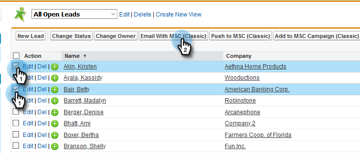
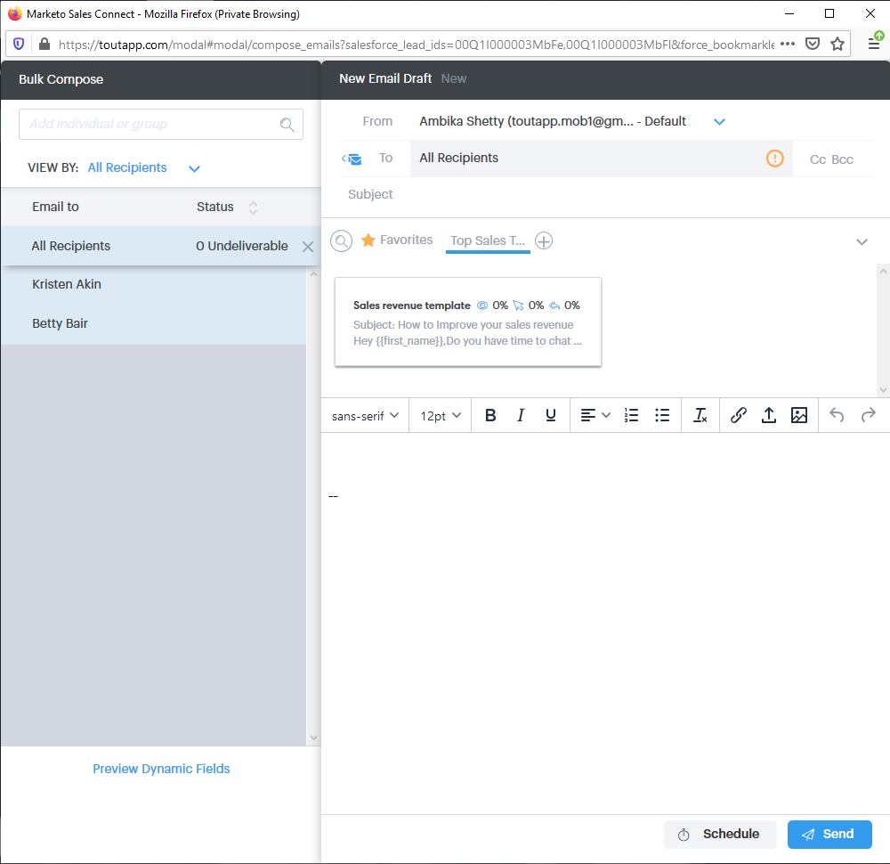
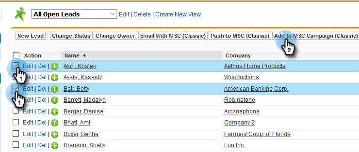
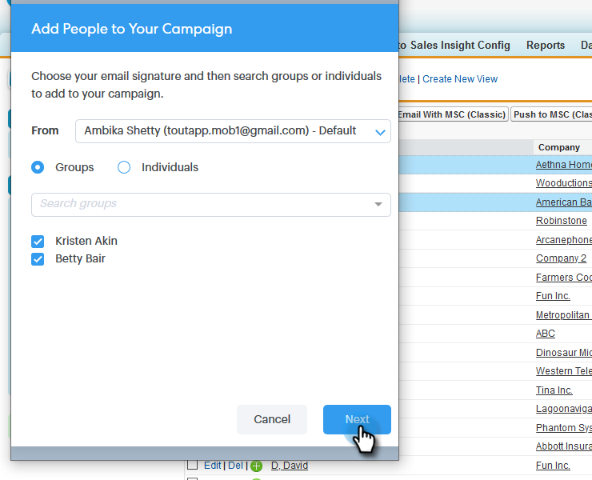
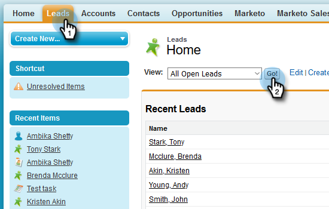
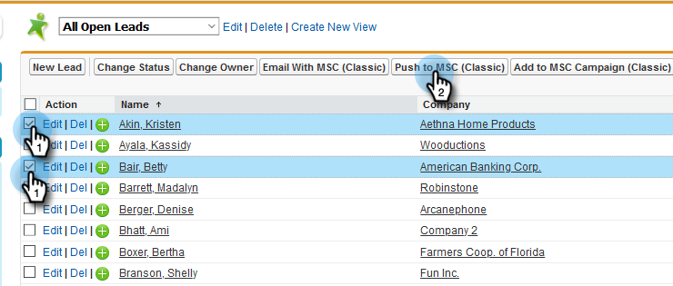
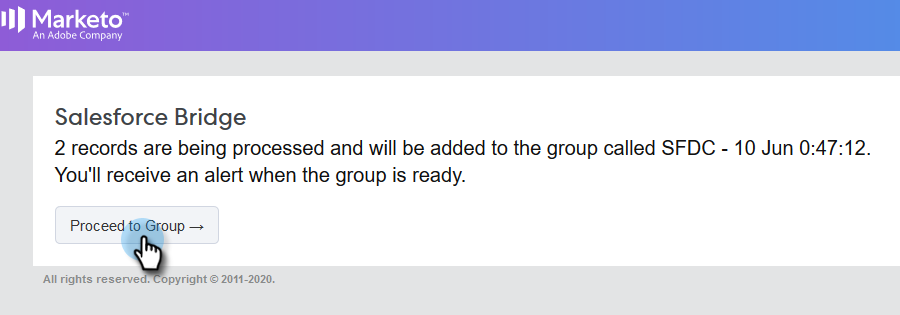
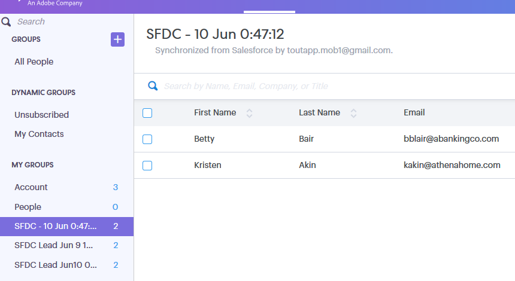

# [!DNL Salesforce] Classic での一括アクションの使用 {#using-bulk-actions-in-salesforce-classic}

キャンペーンへのリードの追加、一括メールの送信、[!DNL Salesforce] から [!DNL Sales Connect] へのリードのプッシュなど、一括アクションの実行方法について説明します。

>[!PREREQUISITES]
>
>[!DNL Sales Connect] パッケージの最新バージョンに更新し、リード／取引先責任者表示に一括アクションボタンをインストールします。[手順については、ここをクリックしてください](https://s3.amazonaws.com/tout-user-store/salesforce/assets/Marketo+Sales+Engage+For+Salesforce_+Installation+and+Success+Guide.pdf)。

>[!NOTE]
>
>概要を説明する手順に従う前に、Marketo Sales Connect アカウントにログインしていることを確認してください。

## 一括メール {#bulk-email}

1. [!DNL Salesforce] で、「**[!UICONTROL リード]**」タブ、「**[!UICONTROL 移動]**」ボタンをクリックします。

   

1. 目的のリードを選択し、「**[!UICONTROL MSC でのメール（クラシック）]**」ボタンをクリックします。

   

1. MSC メールがポップアップ表示されます。次の機能が含まれます。

   a. 「[!UICONTROL  宛先 ]」フィールドに「[!UICONTROL  すべての受信者 ]」と表示される – これは、リードリスト表示で選択したリードのリストに対応しています
b.このリストは、「[!UICONTROL  一括作成 ]」と呼ばれる左側のパネルに表示されます。ここで受信者を追加/削除できます
c. テンプレートを選択するか、独自のメールを作成できます
d. メールに入力される動的フィールドをプレビューできます
e. メールをすぐに送信することも、後で送信するようにスケジュールすることもできます

   

## キャンペーンに追加 {#add-to-campaign}

1. [!DNL Salesforce] で、「**[!UICONTROL リード]**」タブ、「**[!UICONTROL 移動]**」ボタンをクリックします。

   

1. 目的のリードを選択し、「**[!UICONTROL MSC キャンペーンに追加（クラシック）]**」ボタンをクリックします。

   

1. 「[!UICONTROL キャンペーンにリードを追加]」ポップアップが表示されます。「**[!UICONTROL 次へ]**」をクリックし、通常のキャンペーンフローを実行して、MSC キャンペーンをトリガーします。

   

## Marketo セールスコネクトにプッシュ {#push-to-marketo-sales-connect}

1. [!DNL Salesforce] で、「**[!UICONTROL リード]**」タブ、「**[!UICONTROL 移動]**」ボタンをクリックします。

   

1. 目的のリードを選択し、「**[!UICONTROL MSC にプッシュ（クラシック）]**」ボタンをクリックします。

   

1. 「[!UICONTROL Salesforce ブリッジ]」という新しいタブが開きます。「**[!UICONTROL グループに進む→]**」ボタンをクリックします。

   

1. MSC アカウントに移動し、日時スタンプを使用して作成されたグループが表示されます。同期が完了すると、通知が届き、[!DNL Salesforce] から同期されたリードがグループに含まれます。

   

>[!NOTE]
>
>同じ手順に従って、連絡先リスト表示でバルクアクションを使用することもできます。

>[!MORELIKETHIS]
>
>* [グループメールによるメールの送信](/help/marketo/product-docs/marketo-sales-connect/email/using-the-compose-window/sending-emails-via-group-email.md)
>* [「選択して送信」による一括メールの作成](/help/marketo/product-docs/marketo-sales-connect/email/using-the-compose-window/composing-bulk-emails-with-select-and-send.md#sending-emails)
