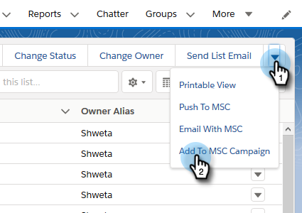

# [!DNL Salesforce Lightning] での一括アクションの使用 {#using-bulk-actions-in-salesforce-lightning}

キャンペーンへのリードの追加、一括メールの送信、リードの [!DNL Salesforce] から [!DNL Sales Connect] へのプッシュなど、一括アクションを実行する方法を説明します。

>[!PREREQUISITES]
>
>[!DNL Sales Connect] パッケージの最新バージョンに更新し、リード/連絡先ビューに一括アクションボタンをインストールします。
>* [ 英語の指示 ](assets/SF+Guide+for+Lightning-EN)
>* [ 日本語の指示 ](assets/SF+Guide+for+Lightning-JA)

>[!NOTE]
>
>以下の手順に従う前に、[!DNL Marketo Sales Connect] アカウントにログインしていることを確認してください。

## 一括メール {#bulk-email}

1. [!DNL Salesforce] で「**[!UICONTROL リード]**」タブをクリックし、目的のリードのリストを選択します。

   

   >[!NOTE]
   >
   >既に使用するリストに存在する場合は、「MSC 一括アクション」ボタンが表示されるように、ドロップダウンからリストを選択して再実行する必要があります。これは変更 [!DNL Salesforce] きない動作です。

1. （画面の右端にある）矢印ドロップダウンをクリックし、「**[!UICONTROL MSC でのメール]**」を選択します。

   

1. MSC メールがポップアップ表示されます。次の機能が含まれます。

   a. 「[!UICONTROL  宛先 ]」フィールドに「すべての入金」と表示されます。これは、「リード・リスト表示」で選択したリードのリストに対応します
b.このリストは、「一括作成」と呼ばれる左側のパネルに表示されます。ここで受信者を追加または削除できます
c. テンプレートを選択するか、独自のメールを作成できます
d. メールをすぐに送信することも、後で送信するようにスケジュールすることもできます

   

## キャンペーンに追加 {#add-to-campaign}

1. [!DNL Salesforce] で「**[!UICONTROL リード]**」タブをクリックし、目的のリードのリストを選択します。

   

1. （画面の右端にある）矢印ドロップダウンをクリックし、「**[!UICONTROL MSC キャンペーンに追加]**」を選択します。

   

1. 「[!UICONTROL  キャンペーンにユーザーを追加 ]」ポップアップが表示されます。 「**[!UICONTROL 次へ]**」をクリックし、通常のキャンペーンフローを実行して、MSC キャンペーンをトリガーします。

   

## [!DNL Marketo Sales Connect] にプッシュ {#push-to-marketo-sales-connect}

1. [!DNL Salesforce] で「**[!UICONTROL リード]**」タブをクリックし、目的のリードのリストを選択します。

   

1. （画面の右端にある）矢印ドロップダウンをクリックし、「**[!UICONTROL MSC にプッシュ]**」を選択します。

   

1. 「[!DNL Salesforce] Bridge」という新しいタブが開きます。 **[!UICONTROL グループに進む ]→** ボタンをクリックします。

   

1. MSC アカウントに送信され、日時スタンプを使用して作成されたグループが表示されます。同期が完了すると通知が届き、[!DNL Salesforce] から同期されたリードがグループに含まれます。

   

>[!NOTE]
>
>同じ手順に従って、連絡先リスト表示でバルクアクションを使用することもできます。

>[!MORELIKETHIS]
>
>* [グループメールによるメールの送信](/help/marketo/product-docs/marketo-sales-connect/email/using-the-compose-window/sending-emails-via-group-email.md)
>* [「選択して送信」による一括メールの作成](/help/marketo/product-docs/marketo-sales-connect/email/using-the-compose-window/composing-bulk-emails-with-select-and-send.md#sending-emails)
