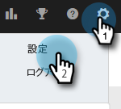
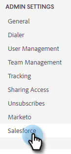
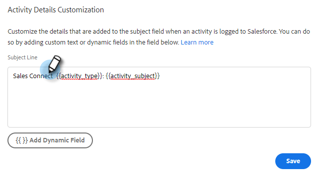

# Salesforce アクティビティ詳細のカスタマイズの設定 {#configure-salesforce-activity-detail-customization}

>[!PREREQUISITES]
>
>* Salesforce と Marketo Sales Connect [が接続されている](/help/marketo/product-docs/marketo-sales-connect/crm/salesforce-integration/connect-your-sales-connect-account-to-salesforce.md)
>* API を使用したメールアクティビティのログが[有効になっている](/help/marketo/product-docs/marketo-sales-connect/crm/salesforce-integration/salesforce-sync-settings.md)

アクティビティの詳細のカスタマイズを使用すると、管理者は、Sales Connect のアクティビティ／リマインダータスクが Salesforce に同期されたときに、Salesforce タスクの件名フィールドに記録する情報を設定できます。

>[!NOTE]
>
>* リマインダータスクの [ セールスコネクト ] の [ 件名 ] フィールドに対して行われた更新は、対応する Salesforce タスクの [ 件名 ] フィールドに反映されます ( `{{activity_subject}}` 動的フィールド（アクティビティの詳細のカスタマイズ）を使用できます。
>* 情報を Salesforce 件名フィールドに記録する場合、改行はサポートされません。 セールスタスクの件名が更新されると、アクティビティの詳細のカスタマイズエディターで改行が削除されます。

<table>
 <tr>
  <td><strong>1</td>
  <td>InMail リマインダータスク</td>
 </tr>
 <tr>
  <td><strong>2</td>
  <td>メールアクティビティ</td>
 </tr>
 <tr>
  <td><strong>3</td>
  <td>通話アクティビティ</td>
 </tr>
</table>

この機能を使用して、次のメリットをアンロックできます。

* 件名フィールドに表示される情報をカスタマイズすることで、Salesforce での販売に関するアクティビティの詳細を簡単にスキャンできます。
* 管理者は、件名フィールドに「Mkto_sales」などの一意の ID をタグ付けできるので、Sales Connect のアクティビティを簡単に識別し、他のメールアクティビティ、通話アクティビティ、タスクと区別できます。
* カスタムアクティビティフィールドの必要性を減らします。Salesforce では、カスタムアクティビティフィールドの数に制限が適用されるので、レポートで使用できるデータを制限できます。アクティビティの動的フィールドを使用して主要データを件名行に追加することで、Salesforce インスタンスで作成する必要のあるカスタムアクティビティフィールドの数を減らすことができます。
* アクティビティとタスクの件名フィールドは、Sales Connect 管理者が定義した一貫したパターンに従います。

>[!NOTE]
>
>メール返信をアクティビティとして Salesforce に記録する場合、Salesforce のアクティビティ詳細カスタマイズ設定は使用されません。 代わりに、は「返信：メールの件名。」

## サポートされるアクティビティの動的フィールド {#activity-dynamic-fields-supported}

アクティビティの動的フィールドでは、セールスアクティビティに関する情報を参照してデータが入力されます。現在、これは Salesforce アクティビティ詳細カスタマイズと共に使用できます。

>[!NOTE]
>
>特定のアクティビティ／タスクの動的フィールドに値を入力する値がない場合、Salesforce タスクの件名フィールドが更新されても、その動的フィールドのデータは入力されません。

<table>
 <tr>
  <th>フィールド</th>
  <th>説明</th>
 </tr>
 <tr>
  <td>{{activity_type}}</td>
  <td>メール、呼び出し、InMail、カスタムのいずれかのタスクタイプが入力されます。</td>
 </tr>
 <tr>
  <td>{{activity_subject}}</td>
  <td>
タスクの件名を入力します。

      
メールの場合は、メールの件名行が入力されます。

      
呼び出し、InMail、カスタムの場合、タスク名／件名フィールドに値を含むリマインダータスクが作成された場合に値が入力されます。
</td>
 </tr>
 <tr>
  <td>{{sales_campaign_name}}</td>
  <td>アクティビティがセールスキャンペーンから開始された場合は、セールスキャンペーンの名前が入力されます。</td>
 </tr>
 <tr>
  <td>{{sales_campaign_day}}</td>
  <td>アクティビティがセールスキャンペーンから開始された場合は、このアクティビティが発生したセールスキャンペーンの日番号が入力されます。</td>
 </tr>
 <tr>
  <td>{{sales_campaign_step}}</td>
  <td>アクティビティがセールスキャンペーンから開始された場合は、このアクティビティが発生したセールスキャンペーン日内の手順番号が入力されます。</td>
 </tr>
 <tr>
  <td>{{call_outcome}}</td>
  <td>アクティビティが呼び出しで、呼び出しの結果が選択されている場合は、呼び出しの結果値が入力されます。</td>
 </tr>
 <tr>
  <td>{{call_reason}}</td>
  <td>アクティビティが呼び出しで、呼び出しの理由が選択されている場合は、呼び出しの理由の値が入力されます。</td>
 </tr>
</table>

## Salesforce アクティビティ詳細のカスタマイズの設定 {#configuring-salesforce-activity-detail-customization}

>[!NOTE]
>
>**管理者権限が必要.**

アクティビティの詳細を設定する際は、Salesforce でタスク履歴を確認する際に、どのデータがセールスに最も関連するかを検討します。

1. 歯車アイコンをクリックし、「**設定**」を選択します。

   

1. 「**Salesforce**」をクリックします。

   

1. 「**同期設定**」をクリックします。

   

1. アクティビティの詳細のカスタマイズエディターで、必要なフリーテキストを追加します。 追加したテキストは動的ではなく、Salesforce に同期されたすべてのタスクの件名フィールドに対して変更されません。

   

   >[!TIP]
   >
   >必須ではありませんが、追加したテキストを角括弧で囲むと、Salesforce の件名フィールドにデータを入力する際に、データ間の識別が容易になります。 例：
`[Sales Connect] - {{Activity_type}}`

1. 必要に応じて、 **ダイナミックフィールドを追加** 」ボタンをクリックします。

   

1. 目的の動的フィールドを選択します。

   

1. 「**保存**」をクリックします。

   

>[!NOTE]
>
>Salesforce では 255 文字の制限が適用されます。アクティビティの詳細がそれを超えると、情報が Salesforce 件名フィールドに保存されるように切り捨てられます。

>[!MORELIKETHIS]
>
>* [同期設定](/help/marketo/product-docs/marketo-sales-connect/crm/salesforce-integration/salesforce-sync-settings.md)
>* [Salesforce とのリマインダータスク同期](/help/marketo/product-docs/marketo-sales-connect/tasks/reminder-task-sync-with-salesforce.md)
>* [CRM 用の Sales Connect のカスタマイズ](/help/marketo/product-docs/marketo-sales-connect/crm/salesforce-customization/sales-connect-customizations-for-crm.md)

