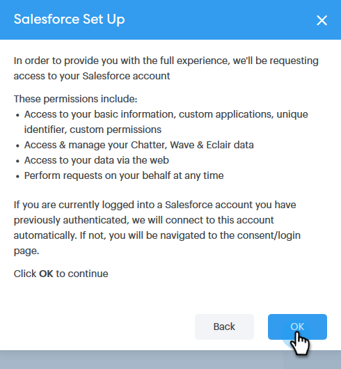
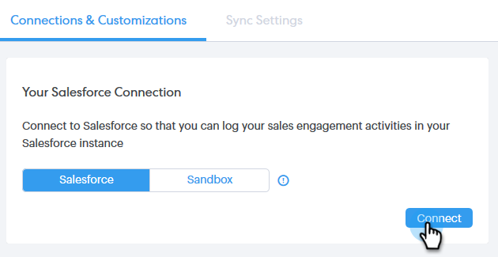

# Sales Connect アカウントの Salesforce への接続 {#connect-your-sales-connect-account-to-salesforce}

次の簡単な手順に従って、[!DNL Sales Connect] を [!DNL Salesforce] に接続します。

## 管理者として接続する方法 {#how-to-connect-as-an-admin}

1. [!DNL Sales Connect] で、右上の歯車アイコンをクリックし、「**[!UICONTROL 設定]**」を選択します。

   

1. 「[!UICONTROL 管理者設定]」で「**[!UICONTROL Salesforce]**」をクリックします。

   

1. 「[!UICONTROL 接続とカスタマイズ]」タブで、「**[!UICONTROL 接続]**」をクリックします。

   

1. 「**[!UICONTROL OK]**」をクリックします。

   

1. 既に Salesforce にログインしている場合は、接続されます。 そうでない場合は、ログインするように求められます。

## 管理者以外のユーザとして接続する方法 {#how-to-connect-as-a-non-admin}

1. [!DNL Sales Connect] で、歯車アイコンをクリックし、「**[!UICONTROL 設定]**」を選択します。

   

1. 「[!UICONTROL マイアカウント]」で、「**[!UICONTROL Salesforce]**」を選択します。

   

1. 「[!UICONTROL 接続とカスタマイズ]」タブで、「**[!UICONTROL 接続]**」をクリックします。

   

1. 「**[!UICONTROL OK]**」をクリックします。

   

1. 既に Salesforce にログインしている場合は、接続されます。 そうでない場合は、ログインするように求められます。
