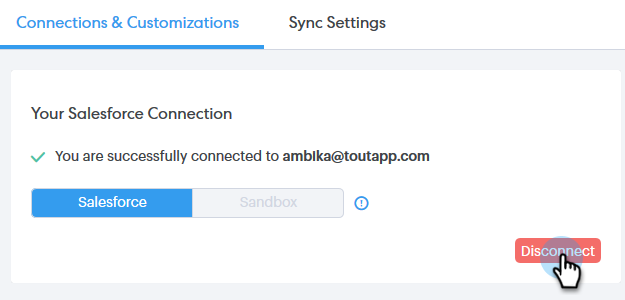

# Salesforce を Sales Connect アカウントから切断 {#disconnect-salesforce-from-your-sales-connect-account}

場合によっては、[!DNL  Salesforce] アカウントを [!DNL Sales Connect] アカウントから切断する必要があります。 手順は以下のとおりです。

## Salesforce から管理者として切断する方法 {#how-to-disconnect-from-salesforce-as-an-admin}

1. [!DNL Sales Connect] で、右上の歯車アイコンをクリックし、「**[!UICONTROL 設定]**」を選択します。

   

1. [!UICONTROL  Admin Settings] で、**[!UICONTROL Salesforce]** をクリックします。

   

1. [[!UICONTROL  接続とカスタマイズ ]] タブで、[**[!UICONTROL 切断]**] をクリックします。

   

## 管理者以外のユーザとして Salesforce との接続を切断する方法 {#how-to-disconnect-from-salesforce-as-a-non-admin}

1. [!DNL  Sales Connect] で、右上の歯車アイコンをクリックし、「**[!UICONTROL 設定]**」を選択します。

   

1. [!UICONTROL  マイアカウント ] で、**[!UICONTROL Salesforce]** を選択します。

   

1. [[!UICONTROL  接続とカスタマイズ ]] タブで、[**[!UICONTROL 切断]**] をクリックします。

   
