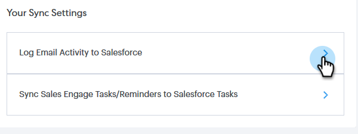

# Salesforce 同期設定 {#salesforce-sync-settings}

## メールアクティビティのログを API 経由で Salesforce に記録 {#logging-email-activity-to-salesforce-via-api}

この機能を使用するには、Salesforce の Enterprise/Unlimited エディション、または Web Services API を通じて統合を購入済みの場合は Professional エディションを使用する必要があります。

>[!PREREQUISITES]
>
>Salesforce とセールスコネクトを連携する必要があります。

1. Sales Connect で、右上の歯車アイコンをクリックし、「**設定**」を選択します。

   

1. マイアカウント（管理者の場合は管理設定）で、**Salesforce** をクリックします。

   

1. 「**同期設定**」タブをクリックします。

   

1. 「メールアクティビティのログを Salesforce に記録」の横の矢印をクリックします。

   

1. 「**Salesforce API**」タブをクリックします。このカードでは、Salesforce に情報を記録する際の環境設定を設定できます。終了したら「**保存**」をクリックします。

   

## メールアクティビティのログを Salesforce にメール送信（BCC）して Salesforce に記録 {#logging-email-activity-to-salesforce-via-email-to-salesforce-bcc}

「Salesforce にメールを送信（BCC）」を有効にすると、セールスメールの BCC が送信され、メールは商談、リード、連絡先に関するアクティビティとして記録されます。

>[!PREREQUISITES]
>
>Salesforce とセールスコネクトを連携する必要があります。

**メール（BCC）を使用して Salesforce にメールを記録するには**

1. Sales Connect で、右上の歯車アイコンをクリックし、「**設定**」を選択します。

   

1. マイアカウント（管理者の場合は管理設定）で、**Salesforce** をクリックします。

   

1. 「**同期設定**」タブをクリックします。

   

1. 「**Salesforce にメールを送信（BCC）**」タブをクリックし、「**有効化**」をクリックします。

   

何らかの理由で Salesforce へのメールアドレスが取り込まれない場合は、次の手順に従って、Salesforce アカウントで BCC 機能を有効にします。

1. Salesforce インスタンスにログインします。
1. 右上隅にあるユーザー名を探し、ドロップダウンバーを選択します。
1. 「**マイ設定**」を選択します。
1. 「**メール**」を選択します。
1. 「**メールを Salesforce に送信**」を選択します。
1. このページに、「Salesforce アドレス宛てにメールを送信」というラベルの付いたフィールドが表示されます。横に何も入力されていない場合は、「アクセス可能なメールアドレス」までスクロールします。
1. BCC を送信するメールアドレスを入力します。
1. 「**変更を保存**」をクリックします。

**マイ設定で Salesforce へのメール送信が見つからない**

「設定」に「Salesforce へのメール送信」が表示されない場合は、管理者が有効にしていない可能性があります。これは、チームが Salesforce を初めて使用した場合や、チームが Salesforce が提供する BCC アドレスを使用したことがない場合に発生する可能性があります。

>[!NOTE]
>
>これを設定するには、管理者権限が必要です。

1. 「**設定**」をクリックします。
1. 「**メール管理**」をクリックします。
1. 「**Salesforce にメール送信**」をクリックします。
1. 「**編集**」をクリックします。
1. 「アクティブ」の横のボックスをオンにします。
1. 「**保存**」をクリックします。

## セールスコネクトタスク/Salesforce タスクのリマインダを同期 {#sync-sales-connect-tasks-reminders-to-salesforce-tasks}

1. 右上の歯車アイコンをクリックし、「**設定**」を選択します。

   

1. マイアカウント（管理者の場合は管理設定）で、**Salesforce** をクリックします。

   

1. 「**同期設定**」タブをクリックします。

   

1. [ セールスコネクトタスク/Salesforce タスクのリマインダを同期 ] の横の矢印をクリックします。

   

1. 目的のオプションを選択します（「Salesforce タスクに同期しない」がデフォルトで選択されています）。

   
