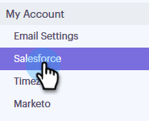

# Salesforce同期設定{#salesforce-sync-settings}

## API {#logging-email-activity-to-salesforce-via-api}を介してSalesforceに電子メールアクティビティをログ記録する

この機能を使用するには、SalesforceのEnterprise/Unlimitedエディション、またはWeb Services API経由で統合を購入している場合はProfessionalエディションを使用する必要があります。

>[!PREREQUISITES]
>
>SalesforceとSales Engageは関連付けられている必要があります。

1. 「Sales Engage」で、右上の歯車アイコンをクリックし、「**設定**」を選択します。

   

1. [マイアカウント] （管理者の場合は[管理設定]）で、[**Salesforce**]をクリックします。

   

1. 「**設定を同期**」タブをクリックします。

   

1. 「Log Email」アクティビティの横にある矢印をクリックしてSalesforceに送信します。

   

1. 「**Salesforce API**」タブをクリックします。 このカードでは、Salesforceに情報を記録する環境設定を設定できます。 終了したら「**保存**」をクリックします。

   

## 電子メールを使用したSalesforceへの電子メールアクティビティのSalesforceへのログ(BCC) {#logging-email-activity-to-salesforce-via-email-to-salesforce-bcc}

「Email to Salesforce (BCC)」をアクティブにすると、販売用電子メールのBCCが送信され、電子メールは商談、リード、連絡先に関するアクティビティとして記録されます。

>[!PREREQUISITES]
>
>SalesforceとSales Engageは関連付けられている必要があります。

**電子メール(BCC)を使用してSalesforceに電子メールをログに記録するには**

1. 「Sales Engage」で、右上の歯車アイコンをクリックし、「**設定**」を選択します。

   

1. [マイアカウント] （管理者の場合は[管理設定]）で、[**Salesforce**]をクリックします。

   

1. 「**設定を同期**」タブをクリックします。

   

1. 「**Salesforceへの電子メール(BCC)**」タブをクリックし、「****&#x200B;アクティブ化」をクリックします。

   

何らかの理由でSalesforce宛ての電子メールアドレスが引き込まれない場合は、次の手順に従ってSalesforceアカウントのBCC機能を有効にします。

1. Salesforceインスタンスにログインします。
1. 右上隅にユーザー名が表示されている場合は、ドロップダウンバーを選択します。
1. 「**マイ設定**」を選択します。
1. 「**電子メール**」を選択します。
1. **Salesforceへの電子メール**&#x200B;を選択します。
1. このページには、「Salesforceアドレスへの電子メール送信」というフィールドが表示されます。 横に何も入力されていない場合は、「My Acceptable Email Addresses」まで下にスクロールします。
1. BCCに含める電子メールアドレスを入力します。
1. 「**変更を保存**」をクリックします。

**設定にSalesforceへの電子メールが見つかりません**

「設定」の下に「Salesforce宛ての電子メール」が表示されない場合は、管理者がこの機能を有効にしていない可能性があります。 これは、Salesforceを初めて使用するチームや、Salesforceが提供するBCCアドレスをチームが使用したことがない場合に発生する可能性があります。

>[!NOTE]
>
>この設定を行うには、管理者権限が必要です。

1. 「**セットアップ**」をクリックします。
1. 「**電子メール管理**」をクリックします。
1. **Salesforce**&#x200B;に電子メールを送信をクリックします。
1. 「**編集**」をクリックします。
1. 「アクティブ」の横のチェックボックスをオンにします。
1. 「**保存**」をクリックします。

## 販売の関与タスク/リマインダをSalesforceタスクに同期{#sync-sales-engage-tasks-reminders-to-salesforce-tasks}

1. 右上の歯車アイコンをクリックし、「**設定**」を選択します。

   

1. [マイアカウント] （管理者の場合は[管理設定]）で、[**Salesforce**]をクリックします。

   

1. 「**設定を同期**」タブをクリックします。

   

1. 「Sync Sales Sales Sengageタスク/リマインダーをSalesforceタスクに同期」の横の矢印をクリックします。

   

1. 目的のオプションを選択します(「Salesforceタスクと同期しない」がデフォルトで選択されます)。

   
